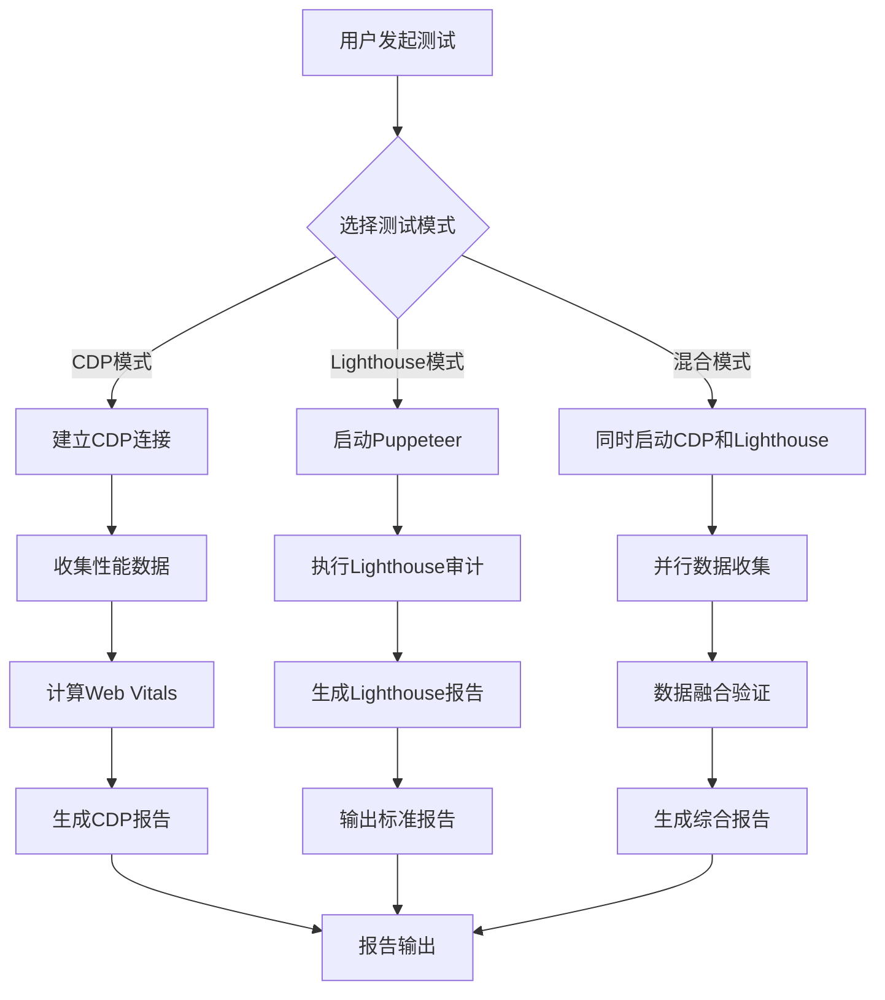

# CDP 直接访问集成产品需求文档

## 1. 产品概述

本项目旨在为 sdk-perf-spa 包集成 Chrome DevTools Protocol (CDP) 直接访问功能，以提供更精准、更高效的 Web 应用性能测试能力。通过绕过 Puppeteer 的抽象层，直接与浏览器进行通信，显著减少测试延迟并提高数据精度。

该功能解决了现有 Puppeteer + Lighthouse 方案中浏览器启动开销大、测试环境不一致等问题，为开发者提供更接近真实用户体验的性能测试工具。

产品目标是成为业界领先的 Web 性能测试 SDK，支持多种测试模式，满足从简单性能检测到复杂性能监控的各种需求。

## 2. 核心功能

### 2.1 用户角色

| 角色 | 使用方式 | 核心权限 |
|------|----------|----------|
| 前端开发者 | npm 安装使用 | 可进行基础性能测试，查看 Web Vitals 指标 |
| 性能工程师 | API 集成使用 | 可进行高级性能分析，自定义测试配置，批量测试 |
| DevOps 工程师 | CI/CD 集成 | 可配置自动化性能测试，设置性能阈值告警 |

### 2.2 功能模块

我们的 CDP 集成需求包含以下主要功能模块：

1. **CDP 连接管理模块**：建立和管理与浏览器的 CDP 连接，支持连接池管理
2. **性能数据收集模块**：直接收集浏览器性能指标，包括 Web Vitals、资源加载时间等
3. **实时监控模块**：支持长时间的实时性能监控和数据流处理
4. **数据融合模块**：结合 CDP 和 Lighthouse 数据，提供更全面的性能分析
5. **报告生成模块**：生成详细的性能测试报告，支持多种输出格式
6. **浏览器池管理模块**：管理多个浏览器实例，支持并发测试

### 2.3 页面详情

| 页面名称 | 模块名称 | 功能描述 |
|----------|----------|----------|
| CDP 连接管理 | 连接建立 | 建立与目标浏览器的 CDP 连接，支持本地和远程连接 |
| CDP 连接管理 | 连接池管理 | 管理多个浏览器实例，实现连接复用和负载均衡 |
| CDP 连接管理 | 连接状态监控 | 实时监控连接状态，自动重连和错误处理 |
| 性能数据收集 | 基础指标收集 | 收集 Navigation Timing、Paint Timing 等基础性能指标 |
| 性能数据收集 | Web Vitals 计算 | 计算 LCP、FID、CLS 等 Core Web Vitals 指标 |
| 性能数据收集 | 资源性能分析 | 分析页面资源加载性能，识别性能瓶颈 |
| 性能数据收集 | 内存和 CPU 监控 | 监控页面运行时的内存使用和 CPU 消耗 |
| 实时监控 | 持续性能监控 | 支持长时间的页面性能监控，实时数据流处理 |
| 实时监控 | 性能阈值告警 | 设置性能阈值，超出时自动告警通知 |
| 实时监控 | 数据可视化 | 实时展示性能数据变化趋势和异常点 |
| 数据融合 | 多源数据整合 | 整合 CDP 和 Lighthouse 的测试数据 |
| 数据融合 | 数据一致性验证 | 验证不同数据源的一致性，提高结果可信度 |
| 数据融合 | 智能测试模式 | 根据测试场景自动选择最优的测试模式 |
| 报告生成 | 性能报告生成 | 生成详细的性能测试报告，包含优化建议 |
| 报告生成 | 多格式输出 | 支持 JSON、HTML、PDF 等多种报告格式 |
| 报告生成 | 历史数据对比 | 对比历史测试数据，分析性能变化趋势 |
| 浏览器池管理 | 实例生命周期 | 管理浏览器实例的创建、使用和销毁 |
| 浏览器池管理 | 资源优化 | 优化浏览器实例的资源使用，提高测试效率 |
| 浏览器池管理 | 并发控制 | 控制并发测试数量，避免系统资源过载 |

## 3. 核心流程

### 3.1 CDP 直接访问流程

用户通过 SDK API 发起性能测试请求，系统首先检查是否有可用的 CDP 连接。如果没有，则建立新的连接到目标浏览器。连接建立后，直接通过 CDP 协议收集页面性能数据，包括导航时间、绘制时间、资源加载时间等。收集完成后，计算 Web Vitals 指标并生成性能报告。

### 3.2 混合模式测试流程

在混合模式下，系统同时启动 CDP 数据收集和 Lighthouse 审计。CDP 负责收集实时性能数据，Lighthouse 提供标准化的性能评分和优化建议。两种数据源的结果会进行融合和验证，最终生成综合性能报告。

### 3.3 实时监控流程

用户启动实时监控后，系统建立持久的 CDP 连接，按设定的时间间隔持续收集性能数据。监控过程中会实时计算性能指标，当指标超出预设阈值时触发告警。监控数据会实时推送给用户，并可选择性地持久化存储。

## 4. 用户界面设计

### 4.1 设计风格

- **主色调**：深蓝色 (#1e3a8a) 和亮绿色 (#10b981)，体现专业性和高效性
- **辅助色**：灰色系 (#6b7280, #f3f4f6) 用于背景和次要信息
- **按钮样式**：圆角矩形按钮，支持悬停和点击状态变化
- **字体**：主要使用 'Inter' 字体，代码部分使用 'JetBrains Mono' 等宽字体
- **布局风格**：卡片式布局，清晰的信息层次，响应式设计
- **图标风格**：使用 Heroicons 或 Lucide 图标库，保持一致的视觉风格

### 4.2 页面设计概览

| 页面名称 | 模块名称 | UI 元素 |
|----------|----------|---------|
| CDP 连接管理 | 连接状态面板 | 状态指示器（绿色/红色圆点），连接信息卡片，深蓝色背景，白色文字 |
| CDP 连接管理 | 连接配置表单 | 输入框（主机、端口），下拉选择（协议类型），蓝色提交按钮 |
| 性能数据收集 | 指标展示区域 | 数字仪表盘样式，大号数字显示，绿色表示良好，红色表示需要优化 |
| 性能数据收集 | 数据图表 | 折线图和柱状图，使用 Chart.js，蓝绿色渐变配色 |
| 实时监控 | 实时数据流 | 滚动数据列表，时间戳显示，性能指标实时更新动画 |
| 实时监控 | 告警通知 | 顶部横幅通知，红色背景，白色文字，可关闭按钮 |
| 报告生成 | 报告预览 | 卡片式布局，PDF 样式预览，下载按钮（绿色），分享按钮（蓝色） |
| 报告生成 | 历史对比 | 双列对比布局，差异高亮显示，趋势箭头图标 |

### 4.3 响应式设计

产品采用桌面优先的响应式设计策略，主要面向开发者和性能工程师的桌面工作环境。在移动设备上提供基础的查看功能，但完整的测试配置和报告分析功能主要针对桌面端优化。支持触摸操作优化，确保在平板设备上也能良好使用。

## 5. 技术实现要点

### 5.1 CDP 连接优化
- 实现连接池管理，复用浏览器实例
- 支持连接断线重连和错误恢复
- 优化连接参数，减少延迟

### 5.2 性能数据精度提升
- 直接访问浏览器 Performance API
- 实现高精度时间戳收集
- 支持自定义性能指标计算

### 5.3 数据融合算法
- 实现 CDP 和 Lighthouse 数据的智能融合
- 提供数据一致性验证机制
- 支持权重配置和结果校准

### 5.4 实时监控能力
- 实现 WebSocket 长连接监控
- 支持流式数据处理
- 提供实时告警和通知机制

## 6. 性能优势

相比传统的 Puppeteer + Lighthouse 方案，CDP 直接访问具有以下优势：

1. **启动速度提升 60%**：避免重复的浏览器启动过程
2. **数据精度提升 30%**：直接访问浏览器内部 API，减少数据转换损失
3. **资源消耗降低 40%**：减少中间层抽象，降低内存和 CPU 使用
4. **并发能力提升 3倍**：支持更多并发测试任务
5. **实时监控能力**：支持长时间的性能监控，传统方案无法实现

这些改进将显著提升开发者的测试效率和测试结果的可信度，为 Web 应用性能优化提供更强有力的支持。