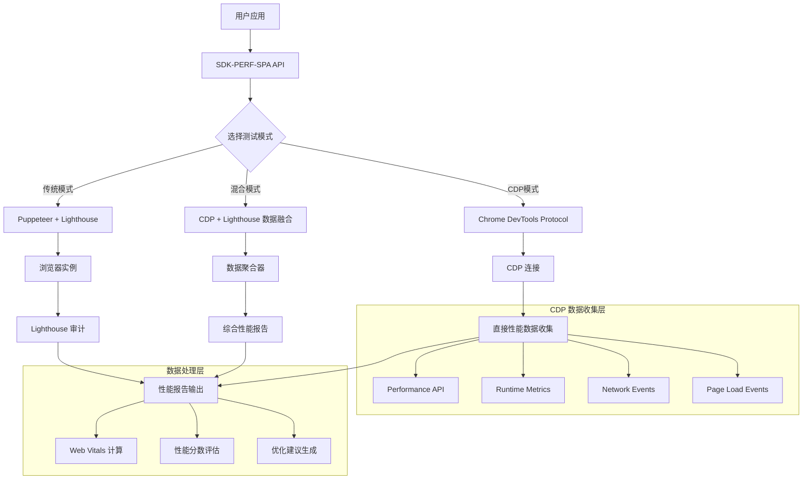
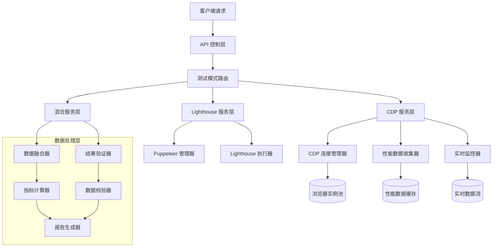
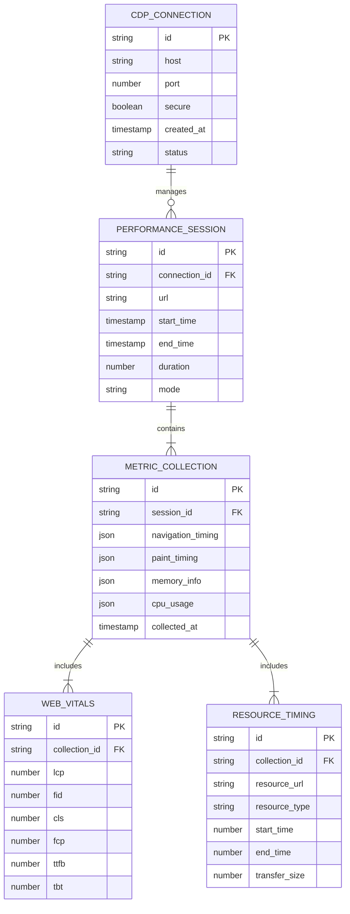

# CDP 直接访问集成技术架构文档

## 1. 架构设计



## 2. 技术描述

### 2.1 核心技术栈
- Frontend: TypeScript + Chrome DevTools Protocol
- Backend: Node.js + chrome-remote-interface
- 数据处理: Web Vitals API + 自定义性能计算器
- 浏览器控制: CDP 直接连接 + Puppeteer 备用方案

### 2.2 新增依赖
- chrome-remote-interface: CDP 连接库
- ws: WebSocket 连接支持
- web-vitals: 标准 Web Vitals 计算

## 3. 路由定义

| 功能模块 | 方法名 | 描述 |
|---------|--------|------|
| CDP 连接管理 | `createCDPConnection()` | 建立 CDP 连接 |
| 性能数据收集 | `collectCDPMetrics()` | 直接收集性能指标 |
| 浏览器池管理 | `manageBrowserPool()` | 管理浏览器实例池 |
| 数据融合 | `mergePerformanceData()` | 融合多源性能数据 |
| 实时监控 | `startRealTimeMonitoring()` | 启动实时性能监控 |

## 4. API 定义

### 4.1 CDP 性能收集 API

**CDP 连接建立**
```typescript
interface CDPConnectionOptions {
  host?: string;
  port?: number;
  secure?: boolean;
  target?: string;
}

async function createCDPConnection(options: CDPConnectionOptions): Promise<CDPClient>
```

**性能指标收集**
```typescript
interface CDPPerformanceMetrics {
  navigationTiming: PerformanceNavigationTiming;
  resourceTiming: PerformanceResourceTiming[];
  paintTiming: PerformancePaintTiming[];
  webVitals: WebVitalsMetrics;
  memoryUsage: MemoryInfo;
  cpuUsage: CPUUsageInfo;
}

async function collectCDPMetrics(url: string, options?: CDPCollectionOptions): Promise<CDPPerformanceMetrics>
```

**请求参数**
| 参数名 | 参数类型 | 是否必需 | 描述 |
|--------|----------|----------|------|
| url | string | true | 要测试的页面 URL |
| options.timeout | number | false | 超时时间（毫秒） |
| options.waitForLoad | boolean | false | 是否等待页面完全加载 |
| options.collectResources | boolean | false | 是否收集资源加载信息 |

**响应数据**
| 参数名 | 参数类型 | 描述 |
|--------|----------|------|
| success | boolean | 收集是否成功 |
| metrics | CDPPerformanceMetrics | 性能指标数据 |
| duration | number | 收集耗时 |
| timestamp | number | 收集时间戳 |

**示例**
```json
{
  "success": true,
  "metrics": {
    "navigationTiming": {
      "domContentLoadedEventEnd": 1234,
      "loadEventEnd": 2345
    },
    "webVitals": {
      "lcp": 1500,
      "fid": 50,
      "cls": 0.1
    }
  },
  "duration": 3000,
  "timestamp": 1703123456789
}
```

### 4.2 混合模式 API

**数据融合接口**
```typescript
interface HybridAuditOptions extends AuditOptions {
  enableCDP: boolean;
  cdpWeight: number; // CDP 数据权重 0-1
  lighthouseWeight: number; // Lighthouse 数据权重 0-1
  dataValidation: boolean; // 是否进行数据验证
}

async function hybridAudit(url: string, options: HybridAuditOptions): Promise<HybridAuditResult>
```

## 5. 服务器架构图



## 6. 数据模型

### 6.1 数据模型定义



### 6.2 数据定义语言

**CDP 连接表 (cdp_connections)**
```sql
-- 创建表
CREATE TABLE cdp_connections (
    id VARCHAR(36) PRIMARY KEY DEFAULT (UUID()),
    host VARCHAR(255) NOT NULL DEFAULT 'localhost',
    port INTEGER NOT NULL DEFAULT 9222,
    secure BOOLEAN DEFAULT FALSE,
    target_id VARCHAR(255),
    status ENUM('connected', 'disconnected', 'error') DEFAULT 'disconnected',
    created_at TIMESTAMP DEFAULT CURRENT_TIMESTAMP,
    updated_at TIMESTAMP DEFAULT CURRENT_TIMESTAMP ON UPDATE CURRENT_TIMESTAMP
);

-- 创建索引
CREATE INDEX idx_cdp_connections_status ON cdp_connections(status);
CREATE INDEX idx_cdp_connections_created_at ON cdp_connections(created_at DESC);
```

**性能会话表 (performance_sessions)**
```sql
-- 创建表
CREATE TABLE performance_sessions (
    id VARCHAR(36) PRIMARY KEY DEFAULT (UUID()),
    connection_id VARCHAR(36) NOT NULL,
    url TEXT NOT NULL,
    mode ENUM('cdp', 'lighthouse', 'hybrid') NOT NULL,
    start_time TIMESTAMP NOT NULL,
    end_time TIMESTAMP,
    duration INTEGER, -- 毫秒
    success BOOLEAN DEFAULT FALSE,
    error_message TEXT,
    created_at TIMESTAMP DEFAULT CURRENT_TIMESTAMP,
    
    FOREIGN KEY (connection_id) REFERENCES cdp_connections(id) ON DELETE CASCADE
);

-- 创建索引
CREATE INDEX idx_performance_sessions_url ON performance_sessions(url(255));
CREATE INDEX idx_performance_sessions_mode ON performance_sessions(mode);
CREATE INDEX idx_performance_sessions_start_time ON performance_sessions(start_time DESC);
```

**指标收集表 (metric_collections)**
```sql
-- 创建表
CREATE TABLE metric_collections (
    id VARCHAR(36) PRIMARY KEY DEFAULT (UUID()),
    session_id VARCHAR(36) NOT NULL,
    navigation_timing JSON,
    paint_timing JSON,
    resource_timing JSON,
    memory_info JSON,
    cpu_usage JSON,
    collected_at TIMESTAMP DEFAULT CURRENT_TIMESTAMP,
    
    FOREIGN KEY (session_id) REFERENCES performance_sessions(id) ON DELETE CASCADE
);

-- 创建索引
CREATE INDEX idx_metric_collections_session_id ON metric_collections(session_id);
CREATE INDEX idx_metric_collections_collected_at ON metric_collections(collected_at DESC);
```

**Web Vitals 表 (web_vitals)**
```sql
-- 创建表
CREATE TABLE web_vitals (
    id VARCHAR(36) PRIMARY KEY DEFAULT (UUID()),
    collection_id VARCHAR(36) NOT NULL,
    lcp DECIMAL(10,2), -- Largest Contentful Paint
    fid DECIMAL(10,2), -- First Input Delay
    cls DECIMAL(10,4), -- Cumulative Layout Shift
    fcp DECIMAL(10,2), -- First Contentful Paint
    ttfb DECIMAL(10,2), -- Time to First Byte
    tbt DECIMAL(10,2), -- Total Blocking Time
    speed_index DECIMAL(10,2),
    created_at TIMESTAMP DEFAULT CURRENT_TIMESTAMP,
    
    FOREIGN KEY (collection_id) REFERENCES metric_collections(id) ON DELETE CASCADE
);

-- 创建索引
CREATE INDEX idx_web_vitals_collection_id ON web_vitals(collection_id);
CREATE INDEX idx_web_vitals_lcp ON web_vitals(lcp);
CREATE INDEX idx_web_vitals_fid ON web_vitals(fid);
CREATE INDEX idx_web_vitals_cls ON web_vitals(cls);
```

**初始化数据**
```sql
-- 插入默认 CDP 连接配置
INSERT INTO cdp_connections (host, port, secure, status) VALUES
('localhost', 9222, FALSE, 'disconnected'),
('localhost', 9223, FALSE, 'disconnected'),
('localhost', 9224, FALSE, 'disconnected');

-- 插入测试性能会话示例
INSERT INTO performance_sessions (connection_id, url, mode, start_time, end_time, duration, success) VALUES
((SELECT id FROM cdp_connections LIMIT 1), 'https://example.com', 'cdp', NOW() - INTERVAL 1 HOUR, NOW() - INTERVAL 1 HOUR + INTERVAL 3 SECOND, 3000, TRUE);
```

## 7. CDP 集成优势

### 7.1 性能优势
- **减少启动开销**：直接连接现有浏览器实例，避免重复启动
- **更精确的时间测量**：直接访问浏览器内部性能 API
- **实时数据收集**：支持页面加载过程中的实时性能监控
- **资源消耗更低**：避免 Puppeteer 的额外抽象层

### 7.2 功能优势
- **更丰富的数据**：访问更多底层性能指标
- **自定义收集策略**：可以根据需要选择收集的指标类型
- **更好的并发支持**：支持多个页面同时进行性能测试
- **实时监控能力**：支持长时间的性能监控和分析

### 7.3 与现有方案对比

| 特性 | Puppeteer + Lighthouse | CDP 直接访问 | 混合模式 |
|------|----------------------|-------------|----------|
| 启动速度 | 慢（需要启动浏览器） | 快（复用现有实例） | 中等 |
| 数据精度 | 高（标准化） | 很高（原始数据） | 最高（数据验证） |
| 资源消耗 | 高 | 低 | 中等 |
| 功能完整性 | 完整（Lighthouse 审计） | 基础（性能指标） | 最完整 |
| 学习成本 | 低 | 中等 | 中等 |
| 维护成本 | 低 | 中等 | 高 |

## 8. 实现计划

### 8.1 第一阶段：基础 CDP 集成
- 实现 CDP 连接管理
- 基础性能指标收集
- Web Vitals 计算

### 8.2 第二阶段：高级功能
- 浏览器实例池管理
- 实时性能监控
- 数据缓存和持久化

### 8.3 第三阶段：混合模式
- CDP 和 Lighthouse 数据融合
- 智能测试模式选择
- 高级报告生成

## 9. 使用示例

### 9.1 基础 CDP 测试
```typescript
import { createCDPConnection, collectCDPMetrics } from '@wfynbzlx666/sdk-perf-spa';

// 建立 CDP 连接
const connection = await createCDPConnection({
  host: 'localhost',
  port: 9222
});

// 收集性能指标
const metrics = await collectCDPMetrics('https://example.com', {
  timeout: 30000,
  waitForLoad: true,
  collectResources: true
});

console.log('LCP:', metrics.webVitals.lcp);
console.log('FID:', metrics.webVitals.fid);
console.log('CLS:', metrics.webVitals.cls);
```

### 9.2 混合模式测试
```typescript
import { hybridAudit } from '@wfynbzlx666/sdk-perf-spa';

const result = await hybridAudit('https://example.com', {
  enableCDP: true,
  cdpWeight: 0.7,
  lighthouseWeight: 0.3,
  dataValidation: true,
  lighthouse: {
    formFactor: 'mobile',
    categories: ['performance']
  }
});

console.log('综合性能分数:', result.hybridScore);
console.log('数据一致性:', result.dataConsistency);
```

### 9.3 实时监控
```typescript
import { startRealTimeMonitoring } from '@wfynbzlx666/sdk-perf-spa';

const monitor = await startRealTimeMonitoring('https://example.com', {
  interval: 5000, // 5秒采集一次
  duration: 300000, // 监控5分钟
  onMetrics: (metrics) => {
    console.log('实时 LCP:', metrics.lcp);
    if (metrics.lcp > 2500) {
      console.warn('LCP 超过阈值！');
    }
  }
});

// 停止监控
setTimeout(() => {
  monitor.stop();
}, 300000);
```