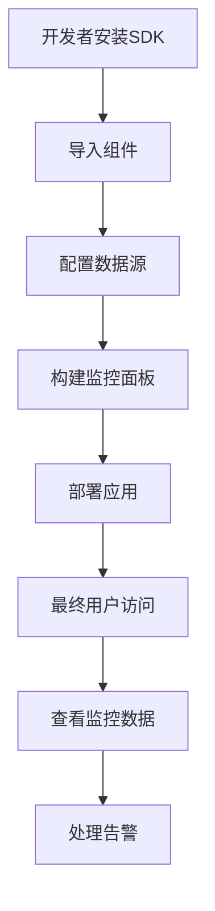

# 监控面板SDK产品需求文档

## 1. Product Overview
基于React生态的监控面板SDK，为开发者提供开箱即用的性能监控、错误追踪、用户行为分析等可视化组件。
- 解决开发者需要快速集成监控面板但不想从零开发的痛点，提供高度可定制的React组件库。
- 目标是成为React生态中最易用的监控面板解决方案，帮助开发者快速构建专业级监控系统。

## 2. Core Features

### 2.1 User Roles
| Role | Registration Method | Core Permissions |
|------|---------------------|------------------|
| 开发者 | npm安装使用 | 可使用所有组件和API，配置监控面板 |
| 最终用户 | 无需注册 | 查看监控数据，使用面板功能 |

### 2.2 Feature Module
我们的监控面板SDK包含以下核心模块：
1. **核心组件库**：仪表盘、图表、指标卡片、告警组件等基础监控组件
2. **数据适配器**：支持多种数据源接入，包括REST API、WebSocket、GraphQL等
3. **主题系统**：内置多套主题，支持自定义主题配置
4. **配置管理**：可视化配置界面，支持拖拽布局和参数调整
5. **插件系统**：支持自定义插件扩展功能

### 2.3 Page Details
| Page Name | Module Name | Feature description |
|-----------|-------------|---------------------|
| 仪表盘组件 | Dashboard | 提供网格布局系统，支持拖拽调整组件位置和大小 |
| 图表组件 | Charts | 包含折线图、柱状图、饼图、热力图等多种图表类型，基于ECharts或D3.js |
| 指标卡片 | MetricCard | 显示关键指标数值，支持趋势显示和阈值告警 |
| 数据表格 | DataTable | 支持分页、排序、筛选的数据展示表格 |
| 告警中心 | AlertCenter | 实时告警展示，支持告警级别分类和处理状态管理 |
| 配置面板 | ConfigPanel | 可视化配置界面，支持组件参数调整和布局设置 |
| 主题切换 | ThemeProvider | 主题管理系统，支持亮色/暗色主题切换 |

## 3. Core Process

**开发者集成流程：**
1. 通过npm安装SDK包
2. 在React项目中导入所需组件
3. 配置数据源和API接口
4. 使用内置组件构建监控面板
5. 可选择使用配置面板进行可视化调整

**最终用户使用流程：**
1. 访问集成了SDK的监控面板
2. 查看实时监控数据和图表
3. 使用筛选和搜索功能定位问题
4. 接收和处理告警信息

## 4. User Interface Design

### 4.1 Design Style
- **主色调**：深蓝色(#1890ff)作为主色，灰色(#f0f2f5)作为背景色
- **按钮样式**：圆角按钮，支持多种尺寸和状态
- **字体**：系统默认字体栈，主要文字14px，标题16-24px
- **布局风格**：卡片式布局，网格系统，响应式设计
- **图标风格**：线性图标，统一的视觉语言

### 4.2 Page Design Overview
| Page Name | Module Name | UI Elements |
|-----------|-------------|-------------|
| 仪表盘组件 | Dashboard | 网格布局容器，拖拽手柄，组件边框，深色主题#001529背景 |
| 图表组件 | Charts | 图表容器，图例，工具栏，缩放控件，颜色渐变#1890ff到#69c0ff |
| 指标卡片 | MetricCard | 白色卡片背景，数值高亮显示，趋势箭头图标，状态色彩指示 |
| 告警中心 | AlertCenter | 列表布局，状态标签，时间戳，严重程度颜色编码(红#ff4d4f/橙#fa8c16/黄#fadb14) |

### 4.3 Responsiveness
桌面优先设计，完全支持移动端适配，包括触摸手势优化和响应式布局调整。在移动端自动调整组件尺寸和交互方式。