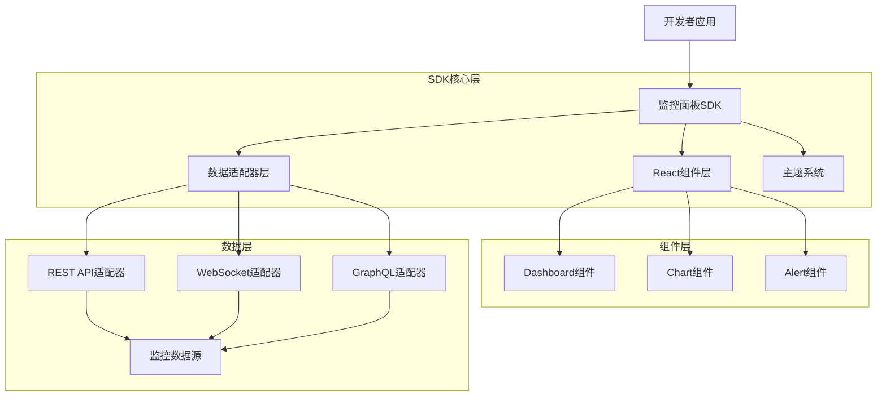
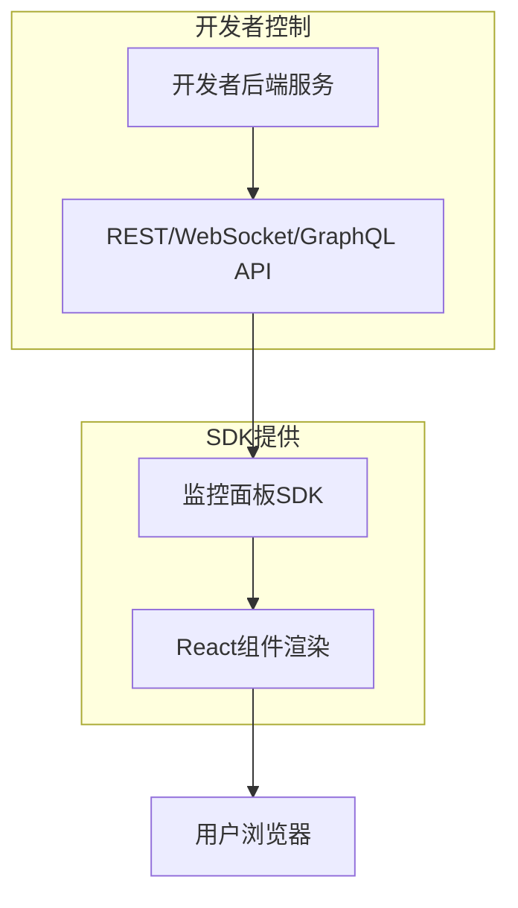
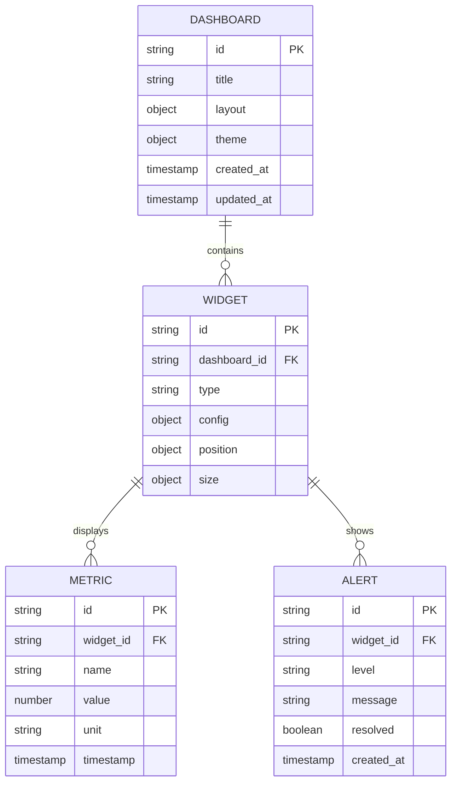

# 监控面板SDK技术架构文档

## 1. Architecture design



## 2. Technology Description

### 2.1 核心技术栈
* Frontend: React\@18 + TypeScript\@5 + Vite\@5 + TailwindCSS\@3
* Charts: ECharts\@5 + React-ECharts
* State Management: Zustand\@4
* Build Tool: Rollup\@4 (用于SDK打包)

### 2.2 DOM挂载技术方案

**采用Portal + Shadow DOM混合方案**

```typescript
class BMTDashboard {
  private shadowRoot: ShadowRoot
  private container: HTMLElement
  
  static mount(selector: string, options: DashboardOptions) {
    const container = document.querySelector(selector)
    
    // 创建Shadow DOM实现样式隔离
    const shadowRoot = container.attachShadow({ mode: 'closed' })
    
    // 在Shadow DOM中渲染React组件
    const dashboardElement = document.createElement('div')
    shadowRoot.appendChild(dashboardElement)
    
    // 注入隔离的样式
    const styles = document.createElement('style')
    styles.textContent = isolatedCSS
    shadowRoot.appendChild(styles)
    
    // 渲染React组件到Shadow DOM
    ReactDOM.render(<Dashboard {...options} />, dashboardElement)
  }
}
```

**支持的挂载方式**
1. **Portal模式**：用户指定容器，SDK渲染到指定位置
2. **Shadow DOM隔离**：完全样式隔离，不影响用户页面
3. **浮动面板模式**：可最小化的悬浮监控面板

### 2.3 性能隔离架构

**核心策略：零性能影响原则**

```typescript
class PerformanceIsolatedDashboard {
  private renderScheduler: IdleRequestCallback
  private performanceGuard: PerformanceGuard
  private worker: Worker
  
  constructor() {
    // 性能保护器
    this.performanceGuard = new PerformanceGuard({
      maxCPUUsage: 0.1, // 最多占用10% CPU
      maxMemoryUsage: 50 * 1024 * 1024, // 最多50MB内存
      maxRenderTime: 16, // 每帧最多16ms
      onThresholdExceeded: () => this.enterLowPerformanceMode()
    })
    
    // 只在浏览器空闲时渲染
    this.scheduleRender = () => {
      requestIdleCallback((deadline) => {
        if (deadline.timeRemaining() > 5) {
          this.performRender()
        } else {
          this.scheduleRender() // 推迟到下次空闲
        }
      })
    }
  }
}
```

**性能优化技术**
1. **渲染性能隔离**：时间切片 + requestIdleCallback
2. **内存管理**：循环缓冲区 + 虚拟滚动 + 定期清理
3. **网络优化**：请求合并 + 批处理 + Service Worker
4. **CPU优化**：Web Worker计算 + 帧率限制
5. **自监控降级**：实时监控自身性能影响，自动降级

## 3. Route definitions

监控面板SDK作为组件库，不涉及路由定义。开发者在自己的应用中决定路由结构。

| Component      | Purpose              |
| -------------- | -------------------- |
| Dashboard      | 主仪表盘容器组件，提供网格布局和拖拽功能 |
| MetricCard     | 指标卡片组件，显示关键性能指标      |
| ChartContainer | 图表容器组件，支持多种图表类型      |
| AlertPanel     | 告警面板组件，实时显示告警信息      |
| ConfigProvider | 配置提供者组件，管理全局配置和主题    |

## 4. API definitions

### 4.1 Core API

**SDK主入口API**

```typescript
class BMTDashboard {
  // 静态方法 - 挂载到指定容器
  static mount(selector: string, options: DashboardOptions): BMTDashboard;
  
  // 静态方法 - 创建浮动面板
  static createFloating(options: FloatingOptions): BMTDashboard;
  
  // 静态方法 - iframe嵌入模式
  static embed(options: EmbedOptions): BMTDashboard;
  
  // 实例方法
  destroy(): void;
  updateConfig(config: Partial<DashboardConfig>): void;
  getPerformanceMetrics(): PerformanceMetrics;
}

interface DashboardOptions {
  // 基础配置
  config: DashboardConfig;
  
  // 性能配置
  performance?: {
    maxCPUUsage?: number; // 默认0.1 (10%)
    maxMemoryUsage?: number; // 默认50MB
    maxRenderTime?: number; // 默认16ms
    enableAutoDegrade?: boolean; // 默认true
  };
  
  // 挂载配置
  mount?: {
    mode: 'portal' | 'shadow-dom' | 'floating';
    isolated?: boolean; // 是否完全样式隔离
    zIndex?: number;
  };
}

interface FloatingOptions extends DashboardOptions {
  position: 'top-left' | 'top-right' | 'bottom-left' | 'bottom-right';
  minimizable: boolean;
  draggable: boolean;
  resizable: boolean;
}

interface EmbedOptions extends DashboardOptions {
  src: string;
  communication: 'postMessage';
  sandbox?: string[];
}
```

**组件配置接口**

```typescript
interface DashboardConfig {
  layout: LayoutConfig[];
  theme: ThemeConfig;
  dataSource: DataSourceConfig;
  performance?: PerformanceConfig;
}

interface LayoutConfig {
  id: string;
  component: string;
  x: number;
  y: number;
  w: number;
  h: number;
  props?: Record<string, any>;
}

interface DataSourceConfig {
  type: 'rest' | 'websocket' | 'graphql';
  endpoint: string;
  headers?: Record<string, string>;
  pollInterval?: number;
}

interface PerformanceConfig {
  renderStrategy: 'idle' | 'frame' | 'immediate';
  dataBufferSize: number;
  virtualScrolling: boolean;
  memoryCleanupInterval: number;
}
```

**数据适配器接口**

```typescript
interface DataAdapter {
  connect(): Promise<void>;
  disconnect(): void;
  subscribe(query: string, callback: (data: any) => void): void;
  unsubscribe(query: string): void;
}

interface MetricData {
  timestamp: number;
  value: number;
  label: string;
  unit?: string;
}

interface AlertData {
  id: string;
  level: 'info' | 'warning' | 'error' | 'critical';
  message: string;
  timestamp: number;
  resolved: boolean;
}
```

**主题配置接口**

```typescript
interface ThemeConfig {
  mode: 'light' | 'dark';
  primaryColor: string;
  backgroundColor: string;
  textColor: string;
  borderColor: string;
  chartColors: string[];
}
```

## 5. Server architecture diagram

监控面板SDK为纯前端组件库，不包含服务端架构。数据来源由开发者的后端服务提供。



## 6. Data model

### 6.1 Data model definition



### 6.2 Data Definition Language

监控面板SDK作为前端组件库，不直接管理数据库。以下是推荐的数据结构，供开发者在后端实现时参考：

```typescript
// 仪表盘配置数据结构
interface DashboardData {
  id: string;
  title: string;
  layout: {
    widgets: WidgetLayout[];
    grid: {
      cols: number;
      rows: number;
      gap: number;
    };
  };
  theme: ThemeConfig;
  createdAt: string;
  updatedAt: string;
}

// 组件布局数据结构
interface WidgetLayout {
  id: string;
  type: 'metric' | 'chart' | 'table' | 'alert';
  position: { x: number; y: number };
  size: { w: number; h: number };
  config: {
    title: string;
    dataQuery: string;
    refreshInterval: number;
    [key: string]: any;
  };
}

// 监控指标数据结构
interface MetricPoint {
  timestamp: number;
  value: number;
  tags?: Record<string, string>;
}

// 告警数据结构
interface AlertItem {
  id: string;
  level: 'info' | 'warning' | 'error' | 'critical';
  title: string;
  message: string;
  source: string;
  timestamp: number;
  resolved: boolean;
  resolvedAt?: number;
  metadata?: Record<string, any>;
}
```

**SDK导出结构**

```typescript
// 主要导出接口
export {
  // 核心类
  BMTDashboard,
  
  // 核心组件
  Dashboard,
  MetricCard,
  ChartContainer,
  AlertPanel,
  DataTable,
  
  // 配置组件
  ConfigProvider,
  ThemeProvider,
  
  // 数据适配器
  RestAdapter,
  WebSocketAdapter,
  GraphQLAdapter,
  
  // 工具函数
  createDashboard,
  createTheme,
  
  // 类型定义
  type DashboardConfig,
  type DashboardOptions,
  type FloatingOptions,
  type EmbedOptions,
  type ThemeConfig,
  type DataSourceConfig,
  type PerformanceConfig,
  type MetricData,
  type AlertData
};
```

## 7. 与BMT-Central-SDK的集成方案

### 7.1 包依赖关系

```typescript
// packages/sdk-dashboard/package.json
{
  "dependencies": {
    "@wfynbzlx666/sdk-core": "workspace:*",
    "@wfynbzlx666/sdk-http": "workspace:*", 
    "@wfynbzlx666/sdk-perf": "workspace:*",
    "@wfynbzlx666/sdk-telemetry": "workspace:*",
    "@wfynbzlx666/sdk-realtime": "workspace:*"
  }
}
```

### 7.2 数据源集成

```typescript
// 集成现有SDK的数据源
class IntegratedDataSource {
  constructor() {
    // 性能数据来源
    this.perfSource = new PerfDataAdapter({
      sdk: Perf, // 来自@wfynbzlx666/sdk-perf
      metrics: ['lcp', 'fid', 'cls', 'memory-usage', 'fps']
    })
    
    // 遥测数据来源  
    this.telemetrySource = new TelemetryDataAdapter({
      sdk: Telemetry, // 来自@wfynbzlx666/sdk-telemetry
      events: ['page-view', 'user-action', 'error']
    })
    
    // 实时数据来源
    this.realtimeSource = new RealtimeDataAdapter({
      sdk: Realtime, // 来自@wfynbzlx666/sdk-realtime
      channels: ['system-metrics', 'alerts']
    })
  }
}
```

### 7.3 性能影响控制

```typescript
class PerformanceGuard {
  private static readonly THRESHOLDS = {
    MAX_CPU_USAGE: 0.1,      // 10%
    MAX_MEMORY_MB: 50,       // 50MB
    MAX_RENDER_TIME_MS: 16,  // 16ms per frame
    MAX_NETWORK_REQUESTS: 5  // 每秒最多5个请求
  }
  
  monitor() {
    // 监控CPU使用率
    this.monitorCPUUsage()
    
    // 监控内存使用
    this.monitorMemoryUsage()
    
    // 监控渲染性能
    this.monitorRenderPerformance()
    
    // 监控网络请求
    this.monitorNetworkRequests()
  }
  
  private enterLowPerformanceMode() {
    console.warn('监控面板进入低性能模式')
    
    // 降低更新频率
    this.setUpdateInterval(5000)
    
    // 禁用动画
    this.disableAnimations()
    
    // 限制数据量
    this.limitDataDisplay(100)
    
    // 暂停非关键功能
    this.pauseSecondaryFeatures()
  }
}
```

### 7.4 用户使用示例

```typescript
// 最简单的使用方式
import { BMTDashboard } from '@wfynbzlx666/sdk-dashboard'

// 挂载到指定容器
BMTDashboard.mount('#dashboard-container', {
  config: {
    layout: [
      { id: 'perf-card', component: 'MetricCard', x: 0, y: 0, w: 4, h: 2 },
      { id: 'error-chart', component: 'ChartContainer', x: 4, y: 0, w: 8, h: 4 }
    ],
    theme: { mode: 'dark' },
    dataSource: { type: 'rest', endpoint: '/api/metrics' }
  },
  performance: {
    maxCPUUsage: 0.05, // 限制为5% CPU使用率
    enableAutoDegrade: true
  },
  mount: {
    mode: 'shadow-dom',
    isolated: true
  }
})

// 创建浮动面板
BMTDashboard.createFloating({
  position: 'bottom-right',
  minimizable: true,
  config: { /* dashboard config */ }
})
```

