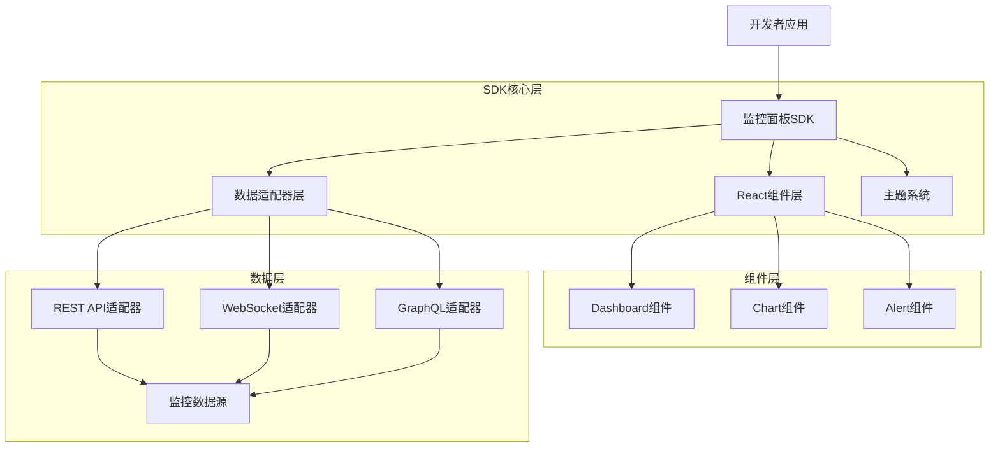
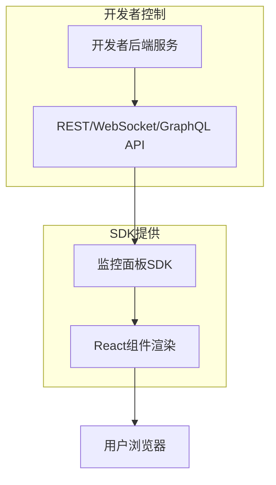
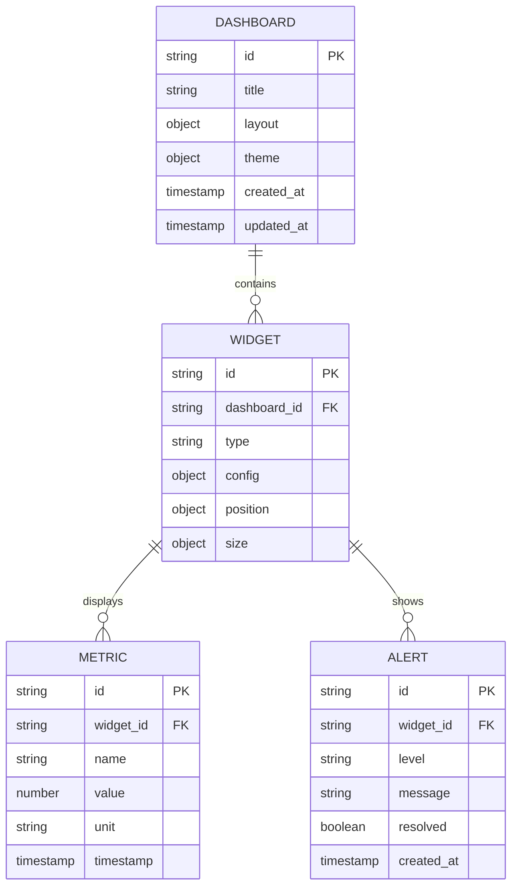

# 监控面板SDK技术架构文档

## 1. Architecture design



## 2. Technology Description

* Frontend: React\@18 + TypeScript\@5 + Vite\@5 + TailwindCSS\@3

* Charts: ECharts\@5 + React-ECharts

* State Management: Zustand\@4

* Build Tool: Rollup\@4 (用于SDK打包)

* Testing: Vitest + React Testing Library

## 3. Route definitions

监控面板SDK作为组件库，不涉及路由定义。开发者在自己的应用中决定路由结构。

| Component      | Purpose              |
| -------------- | -------------------- |
| Dashboard      | 主仪表盘容器组件，提供网格布局和拖拽功能 |
| MetricCard     | 指标卡片组件，显示关键性能指标      |
| ChartContainer | 图表容器组件，支持多种图表类型      |
| AlertPanel     | 告警面板组件，实时显示告警信息      |
| ConfigProvider | 配置提供者组件，管理全局配置和主题    |

## 4. API definitions

### 4.1 Core API

**组件配置接口**

```typescript
interface DashboardConfig {
  layout: LayoutConfig[];
  theme: ThemeConfig;
  dataSource: DataSourceConfig;
}

interface LayoutConfig {
  id: string;
  component: string;
  x: number;
  y: number;
  w: number;
  h: number;
  props?: Record<string, any>;
}

interface DataSourceConfig {
  type: 'rest' | 'websocket' | 'graphql';
  endpoint: string;
  headers?: Record<string, string>;
  pollInterval?: number;
}
```

**数据适配器接口**

```typescript
interface DataAdapter {
  connect(): Promise<void>;
  disconnect(): void;
  subscribe(query: string, callback: (data: any) => void): void;
  unsubscribe(query: string): void;
}

interface MetricData {
  timestamp: number;
  value: number;
  label: string;
  unit?: string;
}

interface AlertData {
  id: string;
  level: 'info' | 'warning' | 'error' | 'critical';
  message: string;
  timestamp: number;
  resolved: boolean;
}
```

**主题配置接口**

```typescript
interface ThemeConfig {
  mode: 'light' | 'dark';
  primaryColor: string;
  backgroundColor: string;
  textColor: string;
  borderColor: string;
  chartColors: string[];
}
```

## 5. Server architecture diagram

监控面板SDK为纯前端组件库，不包含服务端架构。数据来源由开发者的后端服务提供。



## 6. Data model

### 6.1 Data model definition



### 6.2 Data Definition Language

监控面板SDK作为前端组件库，不直接管理数据库。以下是推荐的数据结构，供开发者在后端实现时参考：

```typescript
// 仪表盘配置数据结构
interface DashboardData {
  id: string;
  title: string;
  layout: {
    widgets: WidgetLayout[];
    grid: {
      cols: number;
      rows: number;
      gap: number;
    };
  };
  theme: ThemeConfig;
  createdAt: string;
  updatedAt: string;
}

// 组件布局数据结构
interface WidgetLayout {
  id: string;
  type: 'metric' | 'chart' | 'table' | 'alert';
  position: { x: number; y: number };
  size: { w: number; h: number };
  config: {
    title: string;
    dataQuery: string;
    refreshInterval: number;
    [key: string]: any;
  };
}

// 监控指标数据结构
interface MetricPoint {
  timestamp: number;
  value: number;
  tags?: Record<string, string>;
}

// 告警数据结构
interface AlertItem {
  id: string;
  level: 'info' | 'warning' | 'error' | 'critical';
  title: string;
  message: string;
  source: string;
  timestamp: number;
  resolved: boolean;
  resolvedAt?: number;
  metadata?: Record<string, any>;
}
```

**SDK导出结构**

```typescript
// 主要导出接口
export {
  // 核心组件
  Dashboard,
  MetricCard,
  ChartContainer,
  AlertPanel,
  DataTable,
  
  // 配置组件
  ConfigProvider,
  ThemeProvider,
  
  // 数据适配器
  RestAdapter,
  WebSocketAdapter,
  GraphQLAdapter,
  
  // 工具函数
  createDashboard,
  createTheme,
  
  // 类型定义
  type DashboardConfig,
  type ThemeConfig,
  type DataSourceConfig,
  type MetricData,
  type AlertData
};
```

