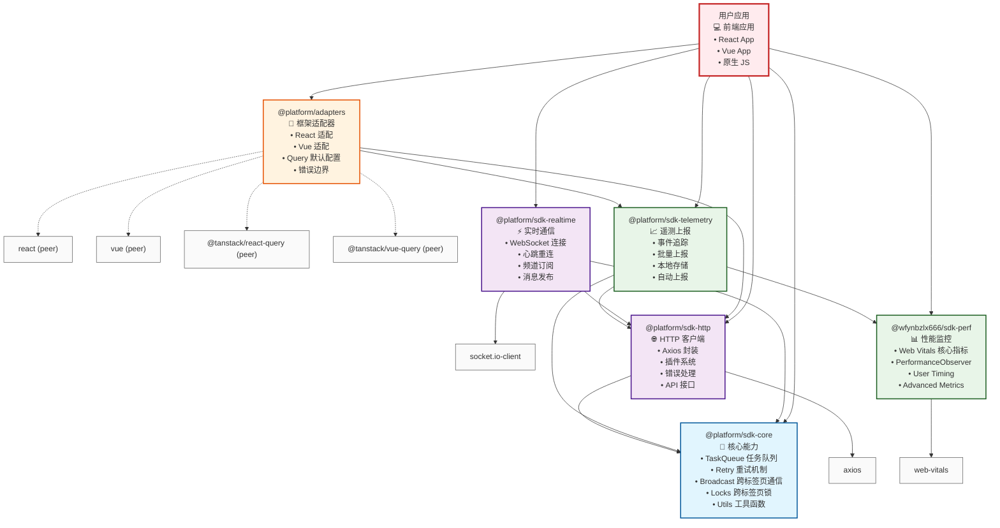
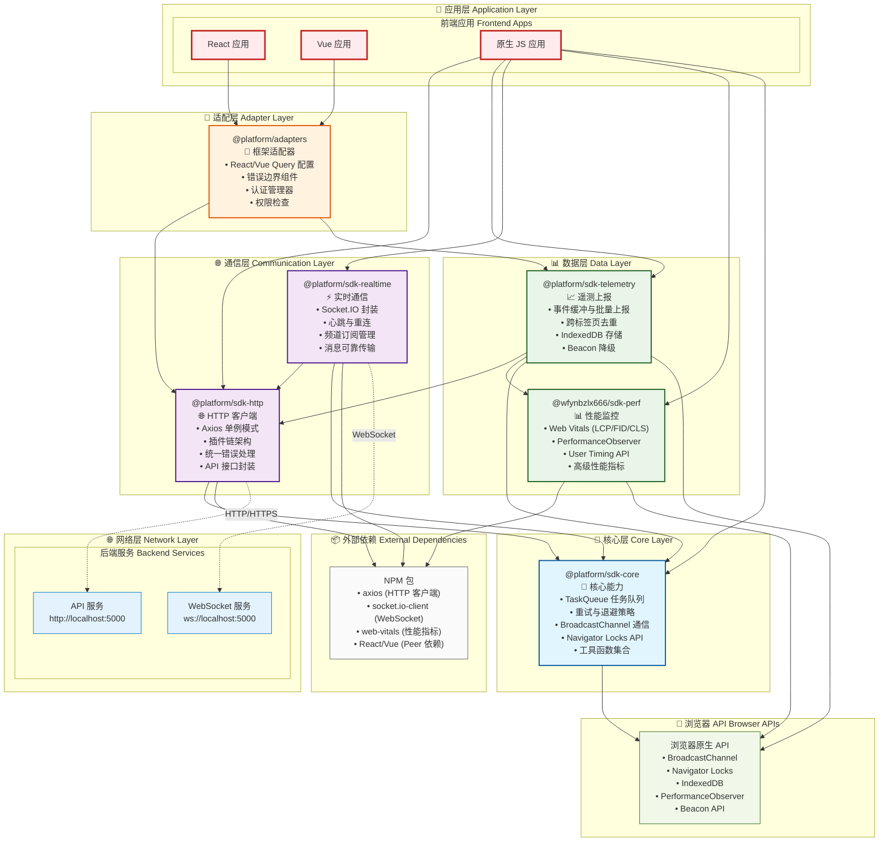

# BMT Central SDK 架构设计文档

## 概述

BMT Central SDK 是一个模块化的前端SDK集合，采用分层架构设计，为BMT技术中台提供统一的网络请求、性能监控、遥测上报、实时通信等能力。

## 架构图

### 包依赖关系图



### 整体分层架构图



## 架构层次说明

### 1. 🔧 核心层 (Core Layer)

**@platform/sdk-core** - 整个SDK的基础设施层

**核心职责：**
- 提供基础的任务队列管理
- 实现重试与退避策略
- 跨标签页通信与协调
- 资源锁定机制
- 通用工具函数

**主要功能：**
- **TaskQueue**: 任务队列管理，支持优先级、批量处理
- **Retry**: 多种重试策略（指数退避、线性退避、固定间隔）
- **Broadcast**: 基于 BroadcastChannel 的跨标签页通信
- **Locks**: 基于 Navigator Locks API 的资源协调
- **Utils**: ID生成、延迟、类型检查等工具函数

**技术特点：**
- 零外部依赖，纯浏览器API实现
- 支持 Web Worker 环境
- 提供 TypeScript 类型支持
- 兼容现代浏览器

### 2. 🌐 通信层 (Communication Layer)

#### @platform/sdk-http - HTTP 通信管理

**核心职责：**
- 统一的HTTP客户端管理
- 插件化的请求/响应处理
- 标准化的错误处理
- 后端API接口封装

**主要功能：**
- **HTTP Client**: 基于 Axios 的单例模式客户端
- **Plugin System**: 可扩展的插件链架构
  - 重试插件 (RetryPlugin)
  - 熔断器插件 (CircuitBreakerPlugin)
  - 限流插件 (RateLimitPlugin)
  - 认证插件 (AuthPlugin)
  - 去重插件 (DedupPlugin)
  - 遥测插件 (TelemetryPlugin)
- **API Interfaces**: 标准化的后端API接口
  - AuthAPI (认证相关)
  - ConfigAPI (配置管理)
  - HealthAPI (健康检查)
  - TelemetryAPI (遥测数据)
  - RealtimeAPI (实时通信)

**依赖关系：**
- 依赖 `@platform/sdk-core` 的重试机制
- 使用 `axios` 作为HTTP客户端

#### @platform/sdk-realtime - 实时通信管理

**核心职责：**
- WebSocket连接管理
- 实时消息传输
- 连接状态监控
- 可靠性保证

**主要功能：**
- **Connection Management**: 连接、断开、重连逻辑
- **Message System**: 频道订阅、消息发布、ACK机制
- **Reliability**: 心跳保活、消息重发、队列管理
- **API Integration**: 与后端实时通信API集成

**依赖关系：**
- 依赖 `@platform/sdk-core` 的任务队列和重试机制
- 依赖 `@platform/sdk-http` 的API接口
- 使用 `socket.io-client` 作为WebSocket客户端

### 3. 📊 数据层 (Data Layer)

#### @wfynbzlx666/sdk-perf - 性能监控

**核心职责：**
- 性能指标收集
- Web Vitals 监控
- 用户体验量化
- 性能数据分析

**主要功能：**
- **Web Vitals**: LCP、FID、CLS、FCP、TTFB 等核心指标
- **Performance Observer**: 资源加载、导航性能监控
- **User Timing**: 自定义性能标记和测量
- **Advanced Metrics**: 长任务、内存使用等高级指标

**技术特点：**
- 独立模块，无内部依赖
- 使用 `web-vitals` 库
- 支持 Web Worker 环境
- 低性能开销设计

#### @platform/sdk-telemetry - 遥测上报

**核心职责：**
- 事件数据收集
- 批量数据上报
- 本地数据存储
- 跨标签页去重

**主要功能：**
- **Event Tracking**: 页面浏览、自定义事件、错误追踪
- **Batch Processing**: 事件缓冲、批量上报、压缩传输
- **Storage Management**: IndexedDB 本地存储、数据持久化
- **Deduplication**: 跨标签页事件去重
- **Fallback**: Beacon API 降级方案

**依赖关系：**
- 依赖 `@platform/sdk-core` 的任务队列和跨标签页通信
- 依赖 `@wfynbzlx666/sdk-perf` 获取性能指标
- 依赖 `@platform/sdk-http` 进行数据上报

### 4. 🔌 适配层 (Adapter Layer)

#### @platform/adapters - 框架适配器

**核心职责：**
- 框架特定的适配逻辑
- 开发者体验优化
- 最佳实践封装
- 统一API抽象

**主要功能：**
- **React Adapter**: React Query 默认配置、错误边界组件
- **Vue Adapter**: Vue Query 默认配置、全局错误处理、路由埋点
- **API Wrappers**: 高级API封装
  - BMTAPI (统一API客户端)
  - AuthManager (认证管理器)
  - ChannelPermissions (权限检查)
- **Utility Functions**: 错误处理、重试函数、类型检查

**依赖关系：**
- 依赖 `@platform/sdk-http` 的API接口
- 依赖 `@platform/sdk-telemetry` 的事件追踪
- Peer 依赖 React/Vue 和对应的 Query 库

### 5. 📱 应用层 (Application Layer)

**用户应用程序**

应用层是SDK的最终使用者，包括：
- **React 应用**: 通过 Adapters 使用SDK
- **Vue 应用**: 通过 Adapters 使用SDK  
- **原生 JS 应用**: 直接使用各个SDK模块

## 详细调用关系

### 包依赖矩阵

| 包名 | sdk-core | sdk-http | sdk-perf | sdk-telemetry | sdk-realtime | adapters |
|------|----------|----------|----------|---------------|--------------|----------|
| **sdk-core** | - | ❌ | ❌ | ❌ | ❌ | ❌ |
| **sdk-http** | ✅ | - | ❌ | ❌ | ❌ | ❌ |
| **sdk-perf** | ❌ | ❌ | - | ❌ | ❌ | ❌ |
| **sdk-telemetry** | ✅ | ✅ | ✅ | - | ❌ | ❌ |
| **sdk-realtime** | ✅ | ✅ | ❌ | ❌ | - | ❌ |
| **adapters** | ❌ | ✅ | ❌ | ✅ | ❌ | - |

### 具体调用场景

#### 1. HTTP 请求流程
```
Application → sdk-http → Plugin Chain → Axios → Backend API
                     ↓
                sdk-core (retry) → TaskQueue → Retry Logic
                     ↓
                sdk-telemetry ← HTTP Plugin ← Request/Response
```

#### 2. 遥测数据上报流程
```
Application → sdk-telemetry → Event Queue → Batch Processor
                           ↓
                     IndexedDB Storage
                           ↓
                     sdk-http → TelemetryAPI → Backend
                           ↓
                     sdk-core → TaskQueue → Retry Logic
```

#### 3. 实时通信流程
```
Application → sdk-realtime → Connection Manager → Socket.IO
                         ↓
                   sdk-core → TaskQueue → Message Queue
                         ↓
                   sdk-http → RealtimeAPI → Backend Stats
```

#### 4. 性能监控流程
```
Browser APIs → sdk-perf → Performance Observer → Metrics Collection
                       ↓
                 sdk-telemetry → Event Tracking → Batch Upload
```

## 技术特性

### 模块化设计
- **独立性**: 每个包都可以独立使用
- **组合性**: 包之间可以灵活组合
- **扩展性**: 支持插件和中间件扩展

### 跨标签页能力
- **数据共享**: 基于 BroadcastChannel 的数据同步
- **资源协调**: 基于 Navigator Locks 的资源管理
- **去重机制**: 避免重复的网络请求和事件上报

### 可靠性保证
- **重试机制**: 多种重试策略，支持指数退避
- **降级方案**: 网络异常时的备用方案
- **本地存储**: 数据持久化，防止丢失
- **错误恢复**: 自动错误恢复和状态修复

### 性能优化
- **批量处理**: 批量上报减少网络请求
- **异步处理**: 非阻塞的异步操作
- **内存管理**: 智能的内存使用和垃圾回收
- **Bundle 优化**: 支持 Tree Shaking，按需引入

### 开发体验
- **TypeScript**: 完整的类型定义和智能提示
- **插件系统**: 可扩展的插件架构
- **错误处理**: 统一的错误处理和报告
- **调试支持**: 丰富的调试信息和工具

## 使用模式

### 基础使用模式
```typescript
import { initHttp } from '@platform/sdk-http'
import { Telemetry } from '@platform/sdk-telemetry'
import { Perf } from '@wfynbzlx666/sdk-perf'

// 初始化
initHttp({ baseURL: 'https://api.example.com' })
Telemetry.init({ app: 'my-app', release: '1.0.0' })
Perf.init({ sampleRate: 0.1 })
```

### React 集成模式
```typescript
import { BMTAPI, AuthManager } from '@platform/adapters'
import { createQueryClientDefaults } from '@platform/adapters/react'

// 配置 React Query
const queryClient = new QueryClient(createQueryClientDefaults())

// 配置认证
AuthManager.configure({
  baseURL: 'https://api.example.com',
  tokenStorage: 'localStorage'
})
```

### Vue 集成模式
```typescript
import { createVueQueryDefaults, createGlobalErrorHandler } from '@platform/adapters/vue'

// 配置 Vue Query
const queryDefaults = createVueQueryDefaults()

// 配置全局错误处理
app.config.errorHandler = createGlobalErrorHandler()
```

## 最佳实践

### 1. 初始化顺序
建议按以下顺序初始化SDK：
1. SDK Core (如果需要自定义配置)
2. SDK HTTP (配置API基础地址)
3. SDK Performance (开始性能监控)
4. SDK Telemetry (开始事件追踪)
5. SDK Realtime (如果需要实时通信)

### 2. 错误处理
- 使用统一的错误处理器
- 实现错误上报机制
- 提供用户友好的错误提示

### 3. 性能优化
- 合理设置采样率
- 使用批量上报减少网络请求
- 避免在关键路径中进行同步操作

### 4. 安全考虑
- 使用HTTPS进行数据传输
- 实现合适的认证机制
- 避免在遥测数据中包含敏感信息

## 扩展指南

### 添加新的HTTP插件
```typescript
import type { HttpPlugin } from '@platform/sdk-http'

const myPlugin: HttpPlugin = {
  name: 'my-plugin',
  onRequest: async (config) => {
    // 请求前处理
    return config
  },
  onResponse: async (response) => {
    // 响应后处理
    return response
  },
  onError: async (error) => {
    // 错误处理
    throw error
  }
}
```

### 添加自定义遥测事件
```typescript
import { Telemetry } from '@platform/sdk-telemetry'

// 自定义事件追踪
Telemetry.trackEvent('user_action', {
  action: 'button_click',
  element: 'header_search',
  timestamp: Date.now()
})
```

### 创建自定义适配器
```typescript
import { createDefaultErrorHandler } from '@platform/adapters'

const myFrameworkAdapter = {
  errorHandler: createDefaultErrorHandler({
    enableTelemetry: true,
    enableConsoleLog: false
  }),
  // 其他适配逻辑
}
```

## 版本兼容性

### 浏览器支持
- Chrome 80+
- Firefox 78+
- Safari 14+
- Edge 80+

### Node.js 支持
- Node.js 18+（开发环境）

### 框架支持
- React 18+
- Vue 3+
- 原生 JavaScript (ES2022+)

---

*本文档描述了 BMT Central SDK v1.0.0 的架构设计。随着SDK的发展，架构可能会有所调整，请以最新版本为准。*
