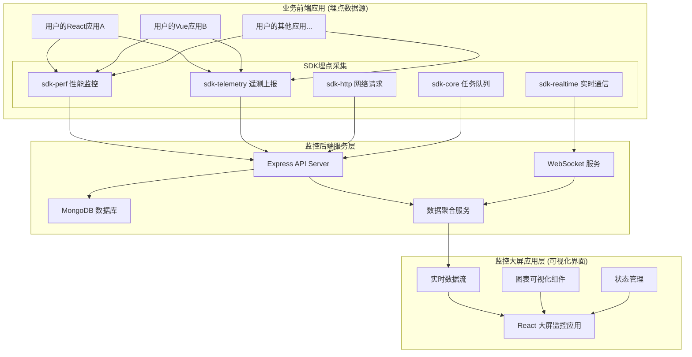

# 大屏可视化监控应用方案设计文档

## 📋 项目概述

基于现有BMT-Central-SDK生态，设计并实现一个独立的React大屏可视化监控应用，主要面向开发者调试和实时监控场景。该应用将充分利用现有SDK的数据采集能力，提供专业级的监控大屏展示。

## 🎯 项目定位

- **目标用户**: 开发人员
- **使用场景**: 实时监控大屏、开发调试工具
- **部署方式**: 独立应用
- **数据持久化**: Express + MongoDB后端

## 🏗️ 整体架构设计



## 📊 数据流设计

### 架构说明

你的理解完全正确！让我明确一下三层架构的职责：

#### 🎯 **业务前端应用 (埋点数据源)**
- 这是**你的用户实际使用的业务应用**（如电商网站、管理后台等）
- 在这些应用中集成你的SDK进行**埋点数据采集**
- SDK在后台静默收集性能、用户行为、错误等数据
- 数据通过API自动上报到监控后端

#### 🖥️ **监控大屏应用 (可视化界面)**  
- 这是**独立的React监控仪表盘应用**
- 专门用于**展示和分析**从业务应用收集来的数据
- 开发者通过这个界面查看性能趋势、错误统计等
- 与业务应用完全分离，不会影响业务应用性能

#### 🔧 **监控后端服务**
- 接收来自业务应用的埋点数据
- 存储、聚合、分析数据
- 为监控大屏提供API和实时数据流

### 数据采集维度

基于现有SDK能力，从业务前端应用中采集以下维度的数据：

#### 1. 性能数据 (`@wfynbzlx666/sdk-perf`)
```typescript
interface PerformanceMetrics {
  // Web Vitals 核心指标
  lcp: number;           // Largest Contentful Paint
  fid: number;           // First Input Delay
  cls: number;           // Cumulative Layout Shift
  fcp: number;           // First Contentful Paint
  ttfb: number;          // Time to First Byte
  
  // 系统性能指标
  fps: number;           // 帧率
  memoryUsage: {         // 内存使用
    used: number;
    total: number;
    percentage: number;
  };
  
  // 网络质量
  networkQuality: {
    rtt: number;         // 往返时间
    downlink: number;    // 下行速度
    effectiveType: string; // 连接类型
  };
  
  // 导航时间
  navigationTiming: {
    dns: number;
    tcp: number;
    request: number;
    response: number;
    dom: number;
  };
}
```

#### 2. 业务数据 (`@wfynbzlx666/sdk-telemetry`)
```typescript
interface BusinessMetrics {
  // 用户行为事件
  userActions: {
    type: string;        // 事件类型
    target: string;      // 目标元素
    timestamp: number;   // 时间戳
    duration?: number;   // 持续时间
    metadata?: any;      // 额外数据
  }[];
  
  // 页面访问统计
  pageViews: {
    url: string;
    referrer: string;
    timestamp: number;
    sessionId: string;
  }[];
  
  // 错误统计
  errors: {
    type: 'js' | 'resource' | 'network';
    message: string;
    stack?: string;
    url: string;
    timestamp: number;
  }[];
}
```

#### 3. 实时数据 (`@wfynbzlx666/sdk-realtime`)
```typescript
interface RealtimeMetrics {
  // 连接状态
  connectionStatus: 'connected' | 'disconnected' | 'reconnecting';
  
  // 消息统计
  messageStats: {
    sent: number;
    received: number;
    failed: number;
    latency: number;
  };
  
  // 在线用户数
  activeUsers: number;
  
  // 系统状态
  systemHealth: {
    cpu: number;
    memory: number;
    disk: number;
  };
}
```

#### 4. 网络数据 (`@wfynbzlx666/sdk-http`)
```typescript
interface NetworkMetrics {
  // HTTP 请求统计
  httpStats: {
    total: number;
    success: number;
    failed: number;
    avgResponseTime: number;
  };
  
  // API 健康状态
  apiHealth: {
    endpoint: string;
    status: 'healthy' | 'degraded' | 'unhealthy';
    responseTime: number;
    errorRate: number;
  }[];
  
  // 错误分析
  errorAnalysis: {
    statusCode: number;
    count: number;
    percentage: number;
  }[];
}
```

#### 5. 任务数据 (`@wfynbzlx666/sdk-core`)
```typescript
interface TaskMetrics {
  // 任务队列状态
  queueStats: {
    pending: number;
    running: number;
    completed: number;
    failed: number;
  };
  
  // 任务执行统计
  executionStats: {
    avgExecutionTime: number;
    successRate: number;
    retryRate: number;
    concurrency: number;
  };
}
```

## 🎨 前端应用设计

### 技术栈选择

```json
{
  "核心框架": "React 18 + TypeScript 5",
  "构建工具": "Vite 5",
  "状态管理": "Zustand 4",
  "图表库": "ECharts 5 + React-ECharts",
  "样式方案": "TailwindCSS 3 + CSS Modules",
  "实时通信": "Socket.IO Client",
  "HTTP客户端": "现有 @wfynbzlx666/sdk-http",
  "工具库": "date-fns, lodash-es"
}
```

### 应用结构

```
dashboard-app/
├── src/
│   ├── components/           # 可视化组件
│   │   ├── charts/          # 图表组件
│   │   │   ├── LineChart.tsx
│   │   │   ├── BarChart.tsx
│   │   │   ├── PieChart.tsx
│   │   │   ├── HeatMap.tsx
│   │   │   └── RealTimeChart.tsx
│   │   ├── cards/           # 指标卡片
│   │   │   ├── MetricCard.tsx
│   │   │   ├── StatusCard.tsx
│   │   │   └── TrendCard.tsx
│   │   ├── layout/          # 布局组件
│   │   │   ├── Dashboard.tsx
│   │   │   ├── Grid.tsx
│   │   │   └── Panel.tsx
│   │   └── common/          # 通用组件
│   │       ├── Loading.tsx
│   │       ├── ErrorBoundary.tsx
│   │       └── Alert.tsx
│   ├── hooks/               # 自定义 Hooks
│   │   ├── useRealTimeData.ts
│   │   ├── useMetrics.ts
│   │   ├── useWebSocket.ts
│   │   └── useChart.ts
│   ├── services/            # 服务层
│   │   ├── api.ts          # API 接口
│   │   ├── websocket.ts    # WebSocket 管理
│   │   └── dataProcessor.ts # 数据处理
│   ├── stores/              # 状态管理
│   │   ├── metricsStore.ts
│   │   ├── configStore.ts
│   │   └── uiStore.ts
│   ├── types/               # 类型定义
│   │   ├── metrics.ts
│   │   ├── api.ts
│   │   └── chart.ts
│   ├── utils/               # 工具函数
│   │   ├── formatters.ts
│   │   ├── calculations.ts
│   │   └── constants.ts
│   ├── styles/              # 样式文件
│   │   ├── globals.css
│   │   ├── dashboard.css
│   │   └── components.css
│   ├── App.tsx
│   ├── main.tsx
│   └── vite-env.d.ts
├── public/
├── package.json
├── vite.config.ts
├── tailwind.config.js
├── tsconfig.json
└── README.md
```

### 核心组件设计

#### 1. 主仪表盘组件
```typescript
interface DashboardProps {
  layout: 'fullscreen' | 'windowed';
  theme: 'light' | 'dark';
  refreshInterval: number;
  autoScale: boolean;
}

const Dashboard: React.FC<DashboardProps> = ({
  layout,
  theme,
  refreshInterval,
  autoScale
}) => {
  // 实时数据订阅
  const metrics = useRealTimeData(refreshInterval);
  
  return (
    <div className={`dashboard dashboard-${layout} theme-${theme}`}>
      {/* 顶部状态栏 */}
      <StatusBar />
      
      {/* 主要指标区域 */}
      <div className="metrics-grid">
        <MetricCard title="Web Vitals" data={metrics.performance} />
        <MetricCard title="实时用户" data={metrics.realtime} />
        <MetricCard title="错误率" data={metrics.errors} />
        <MetricCard title="API健康" data={metrics.api} />
      </div>
      
      {/* 图表区域 */}
      <div className="charts-grid">
        <RealTimeChart 
          title="性能趋势" 
          data={metrics.performance} 
          type="line" 
        />
        <RealTimeChart 
          title="用户活动" 
          data={metrics.userActivity} 
          type="bar" 
        />
        <RealTimeChart 
          title="系统资源" 
          data={metrics.system} 
          type="gauge" 
        />
      </div>
      
      {/* 详细数据区域 */}
      <div className="details-grid">
        <DataTable title="最近错误" data={metrics.recentErrors} />
        <DataTable title="慢请求" data={metrics.slowRequests} />
      </div>
    </div>
  );
};
```

#### 2. 实时图表组件
```typescript
interface RealTimeChartProps {
  title: string;
  data: any[];
  type: 'line' | 'bar' | 'pie' | 'gauge' | 'heatmap';
  height?: number;
  refreshInterval?: number;
}

const RealTimeChart: React.FC<RealTimeChartProps> = ({
  title,
  data,
  type,
  height = 300,
  refreshInterval = 1000
}) => {
  const chartRef = useRef<any>(null);
  
  // 图表配置
  const option = useMemo(() => {
    switch (type) {
      case 'line':
        return createLineChartOption(data);
      case 'bar':
        return createBarChartOption(data);
      case 'gauge':
        return createGaugeChartOption(data);
      default:
        return {};
    }
  }, [data, type]);
  
  // 实时更新
  useEffect(() => {
    const timer = setInterval(() => {
      if (chartRef.current) {
        chartRef.current.setOption(option, true);
      }
    }, refreshInterval);
    
    return () => clearInterval(timer);
  }, [option, refreshInterval]);
  
  return (
    <div className="chart-container">
      <h3 className="chart-title">{title}</h3>
      <ReactECharts
        ref={chartRef}
        option={option}
        style={{ height }}
        opts={{ renderer: 'canvas' }}
      />
    </div>
  );
};
```

## 🔧 后端服务设计

### 技术栈

```json
{
  "运行时": "Node.js 18+",
  "框架": "Express 4",
  "数据库": "MongoDB 6",
  "实时通信": "Socket.IO 4",
  "数据处理": "Node.js Streams",
  "任务队列": "现有 @wfynbzlx666/sdk-core"
}
```

### API 设计

#### 1. 数据接收接口
```typescript
// POST /api/metrics/performance
interface PerformanceDataRequest {
  sessionId: string;
  timestamp: number;
  metrics: PerformanceMetrics;
}

// POST /api/metrics/telemetry
interface TelemetryDataRequest {
  sessionId: string;
  events: TelemetryEvent[];
}

// WebSocket: /realtime
interface RealtimeMessage {
  type: 'metrics' | 'alert' | 'status';
  data: any;
  timestamp: number;
}
```

#### 2. 数据查询接口
```typescript
// GET /api/dashboard/overview
interface DashboardOverview {
  summary: {
    totalUsers: number;
    errorRate: number;
    avgResponseTime: number;
    systemHealth: number;
  };
  trends: {
    performance: TimeSeriesData[];
    errors: TimeSeriesData[];
    users: TimeSeriesData[];
  };
}

// GET /api/metrics/history?type=performance&range=1h
interface MetricsHistoryResponse {
  data: TimeSeriesData[];
  aggregation: 'minute' | 'hour' | 'day';
  total: number;
}
```

### 使用示例

#### 在业务应用中集成SDK (埋点采集)
```typescript
// 用户的业务应用 - main.ts
import { Perf } from '@wfynbzlx666/sdk-perf'
import { Telemetry } from '@wfynbzlx666/sdk-telemetry'
import { initHttp } from '@wfynbzlx666/sdk-http'

// 初始化SDK，配置数据上报地址
initHttp({ 
  baseURL: 'https://your-monitor-backend.com' 
})

// 启动性能监控 (自动采集)
Perf.init({
  sampleRate: 1.0,
  reportEndpoint: '/api/metrics/performance'
})

// 启动遥测上报 (自动采集用户行为)
Telemetry.init({
  autoTrack: true,
  reportEndpoint: '/api/metrics/telemetry'
})

// 业务代码正常运行，SDK在后台自动采集数据
```

#### 监控大屏应用 (数据展示)
```typescript
// 监控大屏应用 - Dashboard.tsx
import { useRealTimeMetrics } from './hooks/useRealTimeMetrics'

const MonitorDashboard = () => {
  // 从监控后端获取聚合数据
  const metrics = useRealTimeMetrics({
    endpoint: 'https://your-monitor-backend.com/api/dashboard/realtime'
  })
  
  return (
    <div className="dashboard">
      <MetricCard title="平均LCP" value={metrics.avgLCP} />
      <Chart data={metrics.performanceTrend} />
      <ErrorList errors={metrics.recentErrors} />
    </div>
  )
}
```

### 数据库设计

#### MongoDB 集合结构

```typescript
// 性能指标集合
interface PerformanceDocument {
  _id: ObjectId;
  sessionId: string;
  timestamp: Date;
  metrics: {
    lcp: number;
    fid: number;
    cls: number;
    fps: number;
    memory: {
      used: number;
      total: number;
    };
  };
  userAgent: string;
  url: string;
  createdAt: Date;
}

// 用户会话集合
interface SessionDocument {
  _id: ObjectId;
  sessionId: string;
  userId?: string;
  startTime: Date;
  endTime?: Date;
  pageViews: number;
  errors: number;
  device: {
    type: 'desktop' | 'mobile' | 'tablet';
    browser: string;
    os: string;
  };
}

// 错误日志集合
interface ErrorDocument {
  _id: ObjectId;
  sessionId: string;
  type: 'js' | 'resource' | 'network';
  message: string;
  stack?: string;
  url: string;
  timestamp: Date;
  resolved: boolean;
  count: number; // 相同错误的聚合计数
}

// 实时状态集合
interface RealtimeStatusDocument {
  _id: ObjectId;
  type: 'system' | 'api' | 'user';
  status: any;
  timestamp: Date;
  ttl: Date; // TTL索引，自动过期
}
```

### 数据聚合服务

```typescript
class DataAggregationService {
  // 实时数据聚合
  async aggregateRealTimeMetrics(): Promise<AggregatedMetrics> {
    const pipeline = [
      {
        $match: {
          timestamp: { $gte: new Date(Date.now() - 60000) } // 最近1分钟
        }
      },
      {
        $group: {
          _id: null,
          avgLCP: { $avg: "$metrics.lcp" },
          avgFID: { $avg: "$metrics.fid" },
          avgCLS: { $avg: "$metrics.cls" },
          avgFPS: { $avg: "$metrics.fps" },
          totalUsers: { $addToSet: "$sessionId" }
        }
      }
    ];
    
    const result = await PerformanceModel.aggregate(pipeline);
    return result[0];
  }
  
  // 历史数据聚合
  async aggregateHistoricalData(
    timeRange: string,
    granularity: 'minute' | 'hour' | 'day'
  ): Promise<TimeSeriesData[]> {
    // 实现时间序列数据聚合逻辑
  }
  
  // 异常检测
  async detectAnomalies(): Promise<Alert[]> {
    // 实现异常检测算法
  }
}
```

## 🚀 部署架构

### 开发环境
```yaml
version: '3.8'
services:
  dashboard-app:
    build: ./frontend
    ports:
      - "3000:3000"
    environment:
      - VITE_API_URL=http://localhost:3001
      - VITE_WS_URL=ws://localhost:3001
    
  api-server:
    build: ./backend
    ports:
      - "3001:3001"
    environment:
      - MONGODB_URI=mongodb://mongo:27017/dashboard
      - NODE_ENV=development
    depends_on:
      - mongo
      
  mongo:
    image: mongo:6
    ports:
      - "27017:27017"
    volumes:
      - mongo_data:/data/db

volumes:
  mongo_data:
```

### 生产环境建议
```yaml
# 推荐部署方案
前端应用: Vercel / Netlify (静态托管)
后端API: Railway / Render (容器化部署)  
数据库: MongoDB Atlas (托管数据库)
CDN: Cloudflare (全球加速)
监控: 自建监控 + 日志聚合
```

## 📈 功能特性

### 核心功能
- [x] **实时性能监控**: Web Vitals、FPS、内存使用
- [x] **用户行为分析**: 页面访问、用户操作、会话统计
- [x] **错误追踪**: JS错误、网络错误、资源加载失败
- [x] **API监控**: 请求统计、响应时间、错误率
- [x] **系统健康**: CPU、内存、磁盘使用情况
- [x] **实时告警**: 阈值监控、异常检测、邮件通知

### 高级功能
- [x] **多维度分析**: 按时间、地区、设备、浏览器分组
- [x] **趋势预测**: 基于历史数据的趋势分析
- [x] **自定义仪表盘**: 拖拽配置、个性化布局
- [x] **数据导出**: CSV、JSON、PDF报告生成
- [x] **多租户支持**: 项目隔离、权限管理
- [x] **移动端适配**: 响应式设计、触摸优化

### 性能优化
- [x] **数据分页**: 大数据量分批加载
- [x] **虚拟滚动**: 长列表性能优化
- [x] **图表缓存**: 避免重复计算和渲染
- [x] **WebSocket复用**: 单连接多频道
- [x] **数据压缩**: gzip压缩、数据去重
- [x] **CDN加速**: 静态资源全球分发

## 🎯 开发计划

### Phase 1: 基础架构 (2周)
- [ ] 项目初始化和环境搭建
- [ ] 后端API服务和数据库设计
- [ ] 前端应用框架和路由
- [ ] SDK数据接入和基础API

### Phase 2: 核心功能 (3周)
- [ ] 实时数据流和WebSocket集成
- [ ] 基础图表组件和指标卡片
- [ ] 性能监控面板
- [ ] 错误追踪和告警系统

### Phase 3: 高级功能 (2周)
- [ ] 数据聚合和历史分析
- [ ] 自定义仪表盘配置
- [ ] 多维度数据分析
- [ ] 导出和报告功能

### Phase 4: 优化完善 (1周)
- [ ] 性能优化和缓存策略
- [ ] 响应式设计和移动端适配
- [ ] 文档编写和部署指南
- [ ] 测试和bug修复

## 💡 技术亮点

### 1. 数据流优化
- **流式处理**: 大数据量实时处理，避免内存溢出
- **智能聚合**: 根据时间窗口自动选择聚合粒度
- **缓存策略**: 多层缓存，减少数据库压力

### 2. 可视化创新
- **自适应图表**: 根据数据特征自动选择最佳图表类型
- **3D可视化**: 复杂数据的立体展示
- **动画过渡**: 平滑的数据变化动画

### 3. 用户体验
- **零配置启动**: 开箱即用的默认配置
- **拖拽布局**: 可视化的仪表盘定制
- **快捷键支持**: 提升操作效率

### 4. 扩展性设计
- **插件系统**: 支持自定义组件和数据源
- **主题系统**: 完全可定制的视觉风格
- **API开放**: 支持第三方系统集成

## 🔒 安全考虑

### 数据安全
- **数据加密**: 传输和存储数据加密
- **访问控制**: 基于角色的权限管理
- **审计日志**: 完整的操作记录

### 系统安全  
- **CORS配置**: 跨域请求安全控制
- **Rate Limiting**: API请求频率限制
- **输入验证**: 严格的数据校验

## 📊 性能指标

### 前端性能目标
- **首屏加载**: < 2秒
- **交互响应**: < 100ms
- **内存使用**: < 100MB
- **CPU使用**: < 10%

### 后端性能目标
- **API响应**: < 200ms (P95)
- **并发处理**: 1000+ 连接
- **数据吞吐**: 10k+ 事件/秒
- **可用性**: 99.9%

---

## 📝 总结

这个大屏可视化监控应用将充分发挥现有BMT-Central-SDK的数据采集能力，通过现代化的React技术栈和专业的可视化组件，为开发者提供一个功能强大、易于使用的监控工具。

**核心优势：**
1. **深度集成**: 与现有SDK无缝集成，数据获取零成本
2. **专业可视化**: 基于ECharts的专业图表库
3. **实时性能**: WebSocket实时数据流，毫秒级更新
4. **易于部署**: 独立应用，支持多种部署方式
5. **高度可定制**: 灵活的配置和扩展能力

该方案既满足了你作为开发调试工具的核心需求，又具备了向企业级监控系统演进的潜力。
