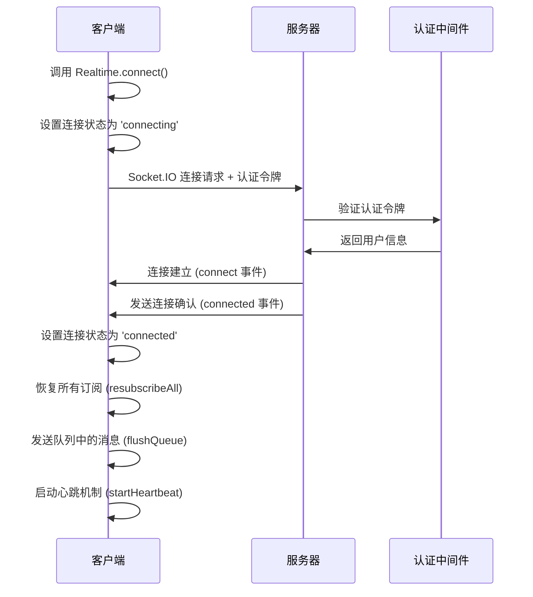
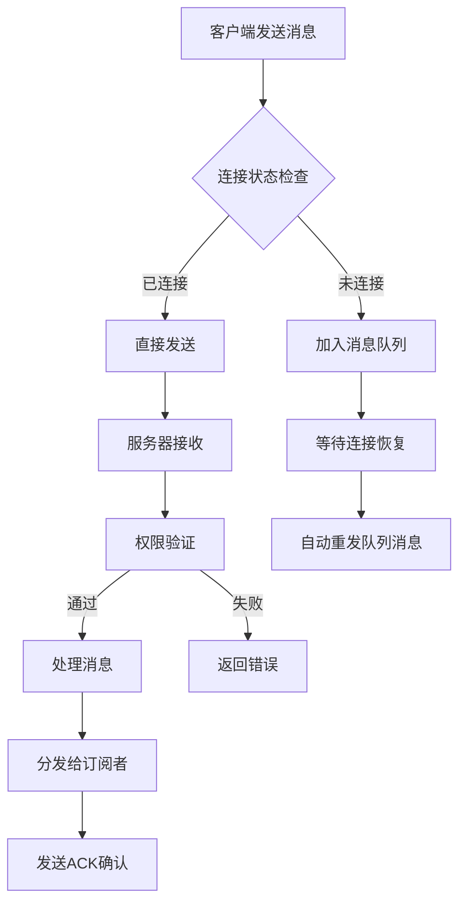
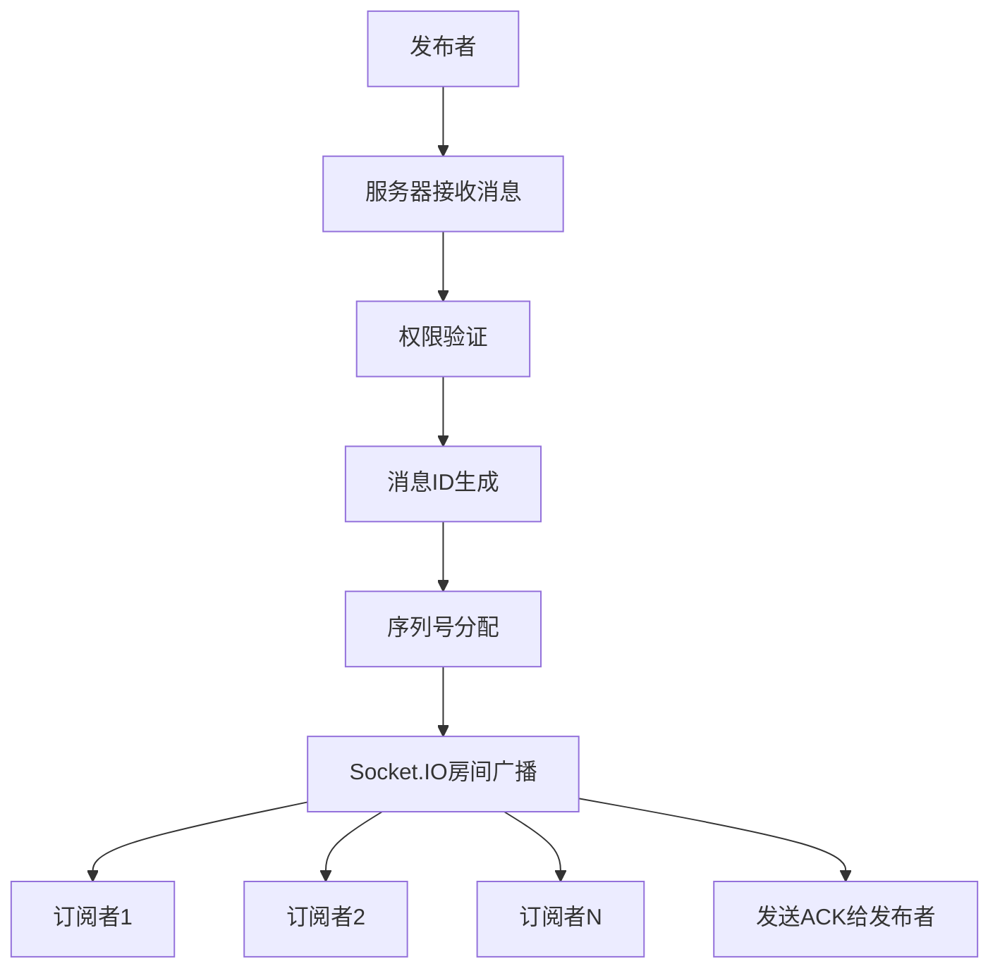
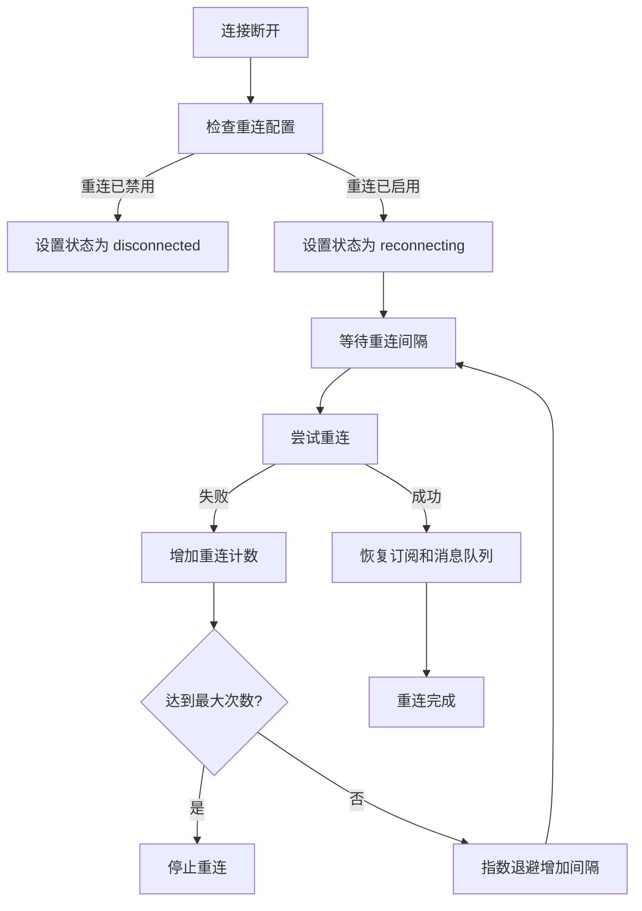

# BMT-Central-SDK 实时通信工作原理详解

## 目录

1. [系统概述](#系统概述)
2. [架构设计](#架构设计)
3. [连接建立流程](#连接建立流程)
4. [消息处理机制](#消息处理机制)
5. [订阅发布模式](#订阅发布模式)
6. [权限控制系统](#权限控制系统)
7. [重连与心跳机制](#重连与心跳机制)
8. [错误处理与容错](#错误处理与容错)
9. [性能优化策略](#性能优化策略)
10. [典型使用场景](#典型使用场景)

---

## 系统概述

BMT-Central-SDK 的实时通信模块基于 Socket.IO 构建，提供了一套完整的双向实时通信解决方案。系统采用客户端-服务器架构，支持消息发布订阅、频道管理、权限控制、自动重连等企业级功能。

### 核心特性

- **基于 Socket.IO**: 利用 WebSocket 和自动降级机制确保连接稳定性
- **发布订阅模式**: 支持多主题的消息路由和分发
- **权限控制**: 细粒度的频道访问和发布权限管理
- **自动重连**: 智能重连策略确保服务可用性
- **消息可靠性**: ACK 确认机制和消息队列保证消息送达
- **统计监控**: 实时连接和消息统计，便于运维监控

---

## 架构设计

### 整体架构

```
┌─────────────────┐    WebSocket/Socket.IO    ┌─────────────────┐
│   客户端 SDK    │ ◄──────────────────────► │   服务器端      │
│                 │                          │                 │
│ ┌─────────────┐ │                          │ ┌─────────────┐ │
│ │ Realtime    │ │                          │ │RealtimeService│ │
│ │   Client    │ │                          │ │              │ │
│ └─────────────┘ │                          │ └─────────────┘ │
│                 │                          │                 │
│ ┌─────────────┐ │                          │ ┌─────────────┐ │
│ │   Message   │ │                          │ │   Channel   │ │
│ │   Queue     │ │                          │ │  Manager    │ │
│ └─────────────┘ │                          │ └─────────────┘ │
│                 │                          │                 │
│ ┌─────────────┐ │                          │ ┌─────────────┐ │
│ │ Permission  │ │                          │ │    Auth     │ │
│ │   System    │ │                          │ │ Middleware  │ │
│ └─────────────┘ │                          │ └─────────────┘ │
└─────────────────┘                          └─────────────────┘
```

### 核心组件

#### 客户端组件

1. **Realtime 主类**: 提供统一的 API 接口，管理连接生命周期
2. **消息队列**: 离线时缓存待发送消息，连接恢复后自动发送
3. **订阅管理器**: 管理主题订阅关系，支持批量重订阅
4. **权限检查器**: 客户端权限预检查，减少无效请求

#### 服务端组件

1. **RealtimeService**: 核心服务类，处理所有实时通信逻辑
2. **连接管理器**: 维护客户端连接状态和元数据
3. **频道管理器**: 管理频道信息和订阅关系
4. **权限控制器**: 实施访问控制和权限验证

---

## 连接建立流程

### 1. 客户端初始化

```typescript
// 初始化实时通信客户端
Realtime.init({
  url: 'ws://localhost:3000',
  auth: () => getAuthToken(),
  heartbeatInterval: 30000,
  reconnect: {
    enabled: true,
    maxAttempts: -1,
    baseMs: 1000,
    capMs: 30000
  }
});
```

### 2. 连接建立序列



### 3. 认证流程

服务器端使用认证中间件验证客户端身份：

```javascript
// 服务器端认证中间件（注释中的实现）
io.use(authenticateSocket);

// 认证成功后存储用户信息
socket.user = {
  userId: 'user123',
  role: 'user',
  permissions: ['private_channel_access']
};
```

---

## 消息处理机制

### 消息类型定义

系统支持以下消息类型：

1. **event**: 业务事件消息，用于传递实际数据
2. **subscribe**: 订阅请求消息
3. **unsubscribe**: 取消订阅消息
4. **publish**: 发布消息请求
5. **heartbeat**: 心跳保活消息

### 消息结构

```typescript
interface RealtimeMessage<T = unknown> {
  type: MessageType;           // 消息类型
  topic?: string;              // 主题名称
  id?: string;                 // 消息唯一ID
  seq?: number;                // 序列号
  payload?: T;                 // 消息载荷
  timestamp: number;           // 时间戳
}
```

### 消息处理流程



---

## 订阅发布模式

### 订阅流程

#### 客户端订阅

```typescript
// 订阅消息
const subscription = Realtime.subscribe('chat-room-1', (message) => {
  console.log('收到消息:', message.payload);
});
```

#### 服务器端处理

```javascript
// 服务器端订阅处理
async handleSubscribe(connectionId, data, callback) {
  const { topic, messageId } = data;
  const connection = this.connections.get(connectionId);
  
  // 1. 权限检查
  if (!this.hasPermission(connection.user, topic, 'subscribe')) {
    return this.sendError(callback, 'permission_denied', '没有订阅权限');
  }
  
  // 2. 加入Socket.IO房间
  connection.socket.join(topic);
  connection.subscribedChannels.add(topic);
  
  // 3. 更新频道信息
  if (!this.channels.has(topic)) {
    this.channels.set(topic, {
      name: topic,
      subscribers: new Set(),
      createdAt: Date.now(),
      messageCount: 0
    });
  }
  
  const channel = this.channels.get(topic);
  channel.subscribers.add(connectionId);
  
  // 4. 发送确认
  this.sendAck(callback, messageId, 'success', {
    topic,
    subscriberCount: channel.subscribers.size
  });
}
```

### 发布流程

#### 客户端发布

```typescript
// 发布消息
await Realtime.publish('chat-room-1', {
  text: 'Hello World!',
  author: 'Alice'
});
```

#### 服务器端分发

```javascript
// 服务器端发布处理
async handlePublish(connectionId, data, callback) {
  const { topic, payload, messageId } = data;
  
  // 1. 权限检查
  if (!this.hasPermission(connection.user, topic, 'publish')) {
    return this.sendError(callback, 'permission_denied', '没有发布权限');
  }
  
  // 2. 生成消息
  const message = {
    id: uuidv4(),
    topic,
    type: 'event',
    payload,
    timestamp: Date.now(),
    from: connection.user.userId,
    seq: this.getNextSequenceNumber(topic)
  };
  
  // 3. 分发给所有订阅者
  this.io.to(topic).emit('message', message);
  
  // 4. 发送确认
  this.sendAck(callback, messageId, 'success', {
    messageId: message.id,
    topic,
    seq: message.seq,
    deliveredTo: channel.subscribers.size
  });
}
```

### 消息分发机制



---

## 权限控制系统

### 权限模型

系统采用基于角色和频道模式的权限控制：

#### 频道命名规范

1. **public:*** - 公共频道，所有用户可访问
2. **private:*** - 私有频道，需要特定权限
3. **user:{userId}*** - 用户个人频道
4. **system:*** - 系统频道，管理员可发布，所有人可订阅

#### 权限检查逻辑

```javascript
// 服务器端权限检查
hasPermission(user, topic, action) {
  // 系统管理员有所有权限
  if (user.role === 'admin') {
    return true;
  }
  
  // 公共频道权限
  if (topic.startsWith('public:')) {
    return true;
  }
  
  // 私有频道权限
  if (topic.startsWith('private:')) {
    return user.permissions?.includes('private_channel_access');
  }
  
  // 用户个人频道
  if (topic.startsWith(`user:${user.userId}`)) {
    return true;
  }
  
  // 系统频道权限
  if (topic.startsWith('system:')) {
    if (action === 'publish') {
      return user.role === 'admin';
    }
    return true; // 所有人可以订阅系统频道
  }
  
  return false;
}
```

#### 客户端权限检查

```typescript
// 客户端权限预检查
static canAccessChannel(channel: string, userRole: string, userId: string): boolean {
  return ChannelPermissions.canAccess(channel, userRole, userId);
}

static canPublishToChannel(channel: string, userRole: string, userId: string): boolean {
  return ChannelPermissions.canPublish(channel, userRole, userId);
}
```

---

## 重连与心跳机制

### 重连策略

#### 客户端重连配置

```typescript
const reconnectConfig = {
  enabled: true,        // 启用自动重连
  maxAttempts: -1,      // 无限重连尝试
  baseMs: 1000,         // 基础重连间隔 1秒
  capMs: 30000          // 最大重连间隔 30秒
};
```

#### 重连流程



### 心跳机制

#### 客户端心跳

```typescript
// 启动心跳定时器
private static startHeartbeat(): void {
  const interval = this.options?.heartbeatInterval ?? 30_000;
  this.heartbeatTimer = setInterval(() => {
    if (this.socket?.connected) {
      this.socket.emit('heartbeat', {
        timestamp: Date.now()
      });
    }
  }, interval);
}
```

#### 服务器端心跳处理

```javascript
// 处理心跳请求
handleHeartbeat(connectionId, data) {
  const connection = this.connections.get(connectionId);
  if (connection) {
    // 更新最后活动时间
    connection.lastActivity = Date.now();
    // 发送心跳确认
    connection.socket.emit('heartbeat_ack', {
      timestamp: Date.now()
    });
  }
}
```

#### 连接清理机制

```javascript
// 清理过期连接
cleanupStaleConnections(timeoutMs = 5 * 60 * 1000) {
  const now = Date.now();
  let cleanedCount = 0;
  
  for (const [connectionId, connection] of this.connections.entries()) {
    if (now - connection.lastActivity > timeoutMs) {
      console.log(`清理过期连接: ${connectionId}`);
      connection.socket.disconnect(true);
      cleanedCount++;
    }
  }
  
  return cleanedCount;
}
```

---

## 错误处理与容错

### 错误类型

1. **连接错误**: 网络断开、服务器不可达
2. **认证错误**: 令牌无效、权限不足
3. **消息错误**: 格式错误、主题不存在
4. **系统错误**: 服务器内部错误、资源不足

### 错误处理策略

#### 客户端错误处理

```typescript
// 连接错误处理
socket.on('connect_error', async (err: any) => {
  console.error('连接错误:', err);
  this.emitConnection(err);
});

// 消息发布错误处理
static async sendPublishMessage(messageData: any): Promise<void> {
  return new Promise((resolve, reject) => {
    this.socket!.emit('publish', messageData, (response: any) => {
      if (response?.status === 'success') {
        resolve();
      } else {
        reject(new Error(response?.error || '发布失败'));
      }
    });
  });
}
```

#### 服务器端错误处理

```javascript
// 统一错误响应
sendError(callback, code, message) {
  if (typeof callback === 'function') {
    callback({
      type: 'error',
      code,
      message
    });
  }
}

// 捕获处理器异常
try {
  await this.handlePublish(connectionId, data, callback);
} catch (error) {
  console.error('发布消息失败:', error);
  this.sendError(callback, 'publish_failed', error.message);
}
```

### 消息队列容错

```typescript
// 离线消息队列管理
private static async send(message: RealtimeMessage<any>): Promise<void> {
  if (!this.socket || this.status !== 'connected') {
    // 队列满时丢弃最旧消息
    if (this.outboundQueue.length >= (this.options?.maxQueueSize ?? 1000)) {
      this.outboundQueue.shift();
    }
    if (message.type === 'event') {
      this.outboundQueue.push(message as EventMessage<any>);
    }
    return;
  }
  
  this.socket.emit(message.type, message);
}
```

---

## 性能优化策略

### 1. 连接池管理

- **连接复用**: 单个应用实例共享一个连接
- **连接清理**: 定期清理过期和无效连接
- **资源限制**: 限制最大连接数和消息队列大小

### 2. 消息优化

- **批量处理**: 合并小消息减少网络开销
- **消息压缩**: Socket.IO 自动压缩大消息
- **序列化优化**: 使用高效的数据序列化格式

### 3. 内存管理

```javascript
// 限制频道订阅者数量
const MAX_SUBSCRIBERS_PER_CHANNEL = 10000;

// 限制消息历史记录
const MAX_MESSAGE_HISTORY = 1000;

// 定期清理内存
setInterval(() => {
  this.cleanupStaleConnections();
  this.cleanupEmptyChannels();
}, 5 * 60 * 1000); // 每5分钟清理一次
```

### 4. 监控指标

```typescript
// 客户端统计信息
static getStats(): {
  status: ConnectionStatus;
  subscriptions: number;
  queueSize: number;
  reconnectCount: number;
} {
  // 计算订阅数量
  let subs = 0;
  for (const set of this.topicListeners.values()) {
    subs += set.size;
  }
  
  return {
    status: this.status,
    subscriptions: subs,
    queueSize: this.outboundQueue.length,
    reconnectCount: this.reconnectCount,
  };
}
```

```javascript
// 服务器端统计信息
getStats() {
  return {
    connections: this.connections.size,
    channels: this.channels.size,
    totalMessages: Array.from(this.channels.values())
      .reduce((total, channel) => total + channel.messageCount, 0),
    channelDetails: Array.from(this.channels.entries()).map(([name, channel]) => ({
      name,
      subscribers: channel.subscribers.size,
      messageCount: channel.messageCount,
      createdAt: channel.createdAt
    }))
  };
}
```

---

## 典型使用场景

### 1. 实时聊天应用

```typescript
// 初始化聊天客户端
await Realtime.connect({
  url: 'ws://chat.example.com',
  auth: () => getUserToken()
});

// 订阅聊天室
const chatSubscription = Realtime.subscribe('chat-room-general', (message) => {
  displayMessage(message.payload);
});

// 发送消息
await Realtime.publish('chat-room-general', {
  text: 'Hello everyone!',
  author: getCurrentUser().name,
  timestamp: Date.now()
});
```

### 2. 实时通知系统

```typescript
// 订阅用户专属通知
const notificationSub = Realtime.subscribe(`user:${userId}:notifications`, (message) => {
  showNotification(message.payload);
});

// 订阅系统公告
const systemSub = Realtime.subscribe('system:announcements', (message) => {
  showSystemAnnouncement(message.payload);
});
```

### 3. 实时协作编辑

```typescript
// 订阅文档变更
const docSub = Realtime.subscribe(`document:${docId}:changes`, (message) => {
  applyDocumentChange(message.payload);
});

// 发布编辑操作
await Realtime.publish(`document:${docId}:changes`, {
  operation: 'insert',
  position: cursor.position,
  content: 'new text',
  userId: getCurrentUser().id
});
```

### 4. 实时数据监控

```typescript
// 订阅监控数据
const monitorSub = Realtime.subscribe('system:metrics', (message) => {
  updateDashboard(message.payload);
});

// 服务器端推送监控数据
setInterval(() => {
  RealtimeService.broadcastSystemNotification(
    'info',
    JSON.stringify({
      cpu: getCPUUsage(),
      memory: getMemoryUsage(),
      connections: getConnectionCount()
    })
  );
}, 5000);
```

---

## 总结

BMT-Central-SDK 的实时通信系统通过以下设计实现了高可用、高性能的实时通信能力：

1. **可靠的连接管理**: 基于 Socket.IO 的自动重连和心跳机制
2. **灵活的消息路由**: 支持多主题的发布订阅模式
3. **完善的权限控制**: 细粒度的频道访问权限管理
4. **强大的容错能力**: 消息队列、错误处理和自动恢复机制
5. **优秀的性能表现**: 连接复用、消息优化和资源管理

该系统适用于各种实时通信场景，从简单的通知推送到复杂的协作应用，都能提供稳定可靠的服务支持。通过合理的配置和使用，可以构建出高质量的实时应用。