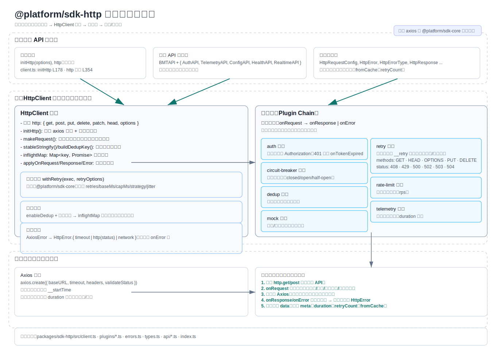
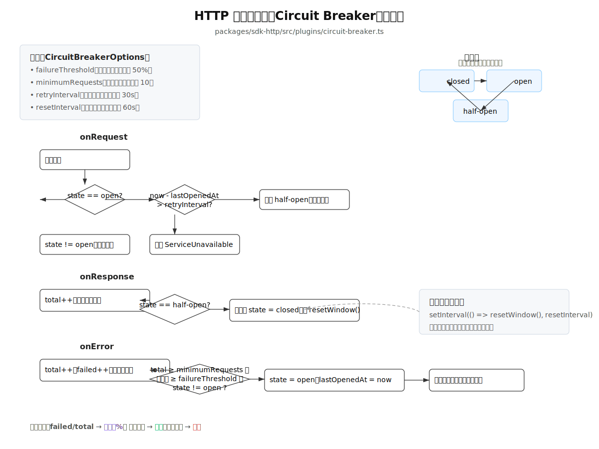

# 任务队列（Task Queue）STAR 面试回答

代码位置：packages/sdk-core/src/task-queue.ts

---

## S（Situation，场景）
- 业务痛点：
  - 前端/SDK 在高并发上报、批量写库或外部 API 密集调用时，瞬时并发容易造成后端过载、数据库死锁与级联失败；客户端缺乏统一的并发闸门、重试/超时与进度观测机制，问题不可控且难以定位。
- 技术背景与约束：
  - 运行于浏览器事件循环之上（单线程），不依赖额外线程或服务；需要以轻量方式实现“应用层调度治理”，同时兼顾高吞吐与稳定性场景。
- 目标读者：
  - SDK 使用方（业务开发）与平台侧（SRE/后端），期望以最小改造接入统一的任务治理能力。

## T（Task，目标）
- 设计目标：
  - 并发治理：限制并发（maxConcurrent）、节流（requestInterval），避免过载与锁竞争；
  - 可靠性：为每个任务提供超时、取消、重试（退避），并明确失败归档；
  - 可观测：实时进度与统计（完成率、失败数、执行中数、耗时等），便于告警与容量评估；
  - 易集成：对外仅需 Promise 风格任务函数 Task<T>(data?, abortSignal?) 即可接入；
  - 可扩展：提供多场景默认策略（高并发/低并发/数据库），支持运行期 updateConfig。
- 可验证的验收口径（示例）：
  - N=500/1000 任务、并发=10 压测下，服务端 5xx 无显著增幅；客户端无“在途任务持续增长”的积压；
  - 超时任务在 timeout 内失败退出；失败任务在 maxRetries 与退避策略内有序收敛；
  - 回调与统计可驱动观测：percentage、elapsedTime、successRate 可用于阈值报警与容量评估。

## A（Action，行动/方案）
- 并发调度与优先级：
  - 生产者-消费者模型；队列按 priority 降序排序，高优先任务优先出队；
  - processQueue 控制并发闸门（执行中任务数 < maxConcurrent 时才调度），并按 requestInterval 进行轻量节流；
  - 调度循环与执行解耦：队列循环非阻塞执行任务，空闲时自动继续调度。
- 生命周期与控制面：
  - 状态：pending → executing → completed/failed 或 retrying；
  - 控制：start/pause/resume/stop/clear/updateConfig/retryFailedTasks 覆盖运行期运维动作；
  - 停止：stop 触发 AbortController 中断在途任务，防止继续占用资源。
- 可靠性增强：
  - 超时：任务与 timeoutPromise 做 Promise.race，避免“悬挂任务”；
  - 重试：记录重试计数，按 retryDelay × retries 做退避（可扩展为指数退避+jitter），超过 maxRetries 归档 failed；
  - 取消：每个任务持有 AbortController，业务 fn 可响应 signal 实现快速中断与资源清理。
- 可观测性与回调：
  - 回调：onProgress（实时进度）、onTaskComplete（单任务结论）、onQueueComplete（整体收敛）；
  - 统计：total/completed/failed/executing/pending、percentage、elapsedTime、successRate，用于 UI 展示与埋点上报。
- 易用性与复用：
  - 任务抽象：Task<T> = (data?, abortSignal?) => Promise<T>；
  - 预设工厂：createHighConcurrencyTaskQueue / createLowConcurrencyTaskQueue / createDatabaseTaskQueue，降低配置成本。
- 取舍与对比：
  - 不直接用“裸 Promise + setTimeout”：缺乏全局并发闸门与统一重试策略，可观测性不足；
  - 不引入 Web Worker：本方案聚焦调度治理，Worker 带来的序列化/集成成本不划算；
  - 与 RxJS/第三方库对比：本实现学习/集成成本更低，回调与统计契合 SDK 约定且易于按场景裁剪。
- 边界与风险意识：
  - 优先级饥饿：持续高优先任务可能饿死低优先；可引入老化或加权轮询；
  - 幂等性：重试可能引发副作用重复，业务需保证幂等或区分“可重试/不可重试”错误；
  - 积压与背压：持续 inflow 可能堆积；可设置最大队列长度并向上游反馈背压；
  - 超时/取消：业务任务需响应 AbortSignal，否则仍可能耗资源（队列视角已失败）。

## R（Result，结果/价值）
- 将不可控的瞬时并发变为“可控并发阈值 + 调度节奏”，显著降低后端过载与数据库死锁风险；
- 将无序重试变为“有上限且退避的重试”，提升整体成功率并避免二次雪崩；
- 进度与统计让故障可观察、可复盘：快速分辨“任务不稳定”还是“资源不足”，沉淀成功率/耗时指标；
- 低接入成本：业务以 Task 形式提交即可复用调度与容错能力；
- 一套代码适配多场景（高并发/低并发/数据库），运行期可动态调参，落地维护成本低。

---

# 性能监控（Perf SDK）STAR 面试回答

代码位置：packages/sdk-perf/src/perf.ts、packages/sdk-perf/src/advanced-metrics.ts

## S（Situation，场景）
- 业务痛点：
  - 缺乏统一的前端性能观测口径，难以跨应用对比与定位瓶颈（仅有零散埋点或浏览器面板手查）。
  - 仅监控首屏加载，忽视交互流畅度（长任务、TBT、FPS）与运行时退化（内存、网络质量）。
  - 观测对业务有侵入且开销不可控，生产环境担心性能损耗与隐私合规。
- 技术约束：
  - 需在浏览器环境轻量运行，兼容多浏览器与降级场景；对老页面最小改造即可接入。
  - 指标采样与异步处理，确保监控对业务性能影响可控。

## T（Task，目标）
- 建立“可对比、可复盘”的统一性能指标体系：Web Vitals + 导航/资源加载 + 高级交互与系统指标。
- 低侵入、低开销：通过采样、惰性初始化与解耦上报，避免影响业务关键路径。
- 高可用与可扩展：模块化开关（高级指标、内存泄漏、关键渲染路径），可按需启用。
- 易用性：提供简单 API（init/onMetric/mark/measure），配合阈值分级与类型提示。

## A（Action，行动/方案）
- 指标覆盖：
  - Web Vitals：LCP、CLS、FID、FCP、TTFB 动态引入采集，统一回调输出。
  - PerformanceObserver：导航分段（DNS/TCP/TTFB/DCL/Load）、资源加载、长任务、内存使用等全面采集。
  - 高级指标：
    - FPS 实时监控（requestAnimationFrame 循环、丢帧统计）。
    - 交互时延：首输入延迟、持续交互性、长任务阻塞分析（>50ms）。
    - 环境维度：NetworkInformation（类型、带宽、RTT）与设备信息（CPU 核心、内存、屏幕）。
    - 生命周期：可见性变更、加载/卸载/冻结/恢复，统一埋点时序。
  - 用户自定义：User Timing API 封装（mark/measure/clear），支持复杂业务流程测量。
- 开销与合规：
  - 采样率控制（默认 0.1），异步处理与去抖聚合，避免主线程抖动；敏感字段白名单化。
  - 按需启用高级模块，提供统一清理函数，确保监听器与循环可释放，避免内存泄漏。
- 易集成：
  - 类型安全输出 PerfMetric 与阈值配置 PerfThresholds；与平台遥测对接时解耦合上报（可通过回调对接批量上报）。

## R（Result，结果/价值）
- 指标体系从“开发者各说各话”统一到“平台口径”，跨项目可比，问题定位更快。
- 关键路径与交互流畅度均可量化（LCP/TBT/FPS/长任务占比），形成优化闭环与SLO基线。
- 在默认采样率与异步处理下，对页面 CPU/内存的额外开销可控，生产可安全启用；多浏览器覆盖良好。

---

# 实时通信（Realtime SDK）STAR 面试回答

代码位置：packages/sdk-realtime/src/realtime.ts、packages/sdk-realtime/src/index.ts

## S（Situation，场景）
- 业务痛点：
  - 运营面板、通知系统与协作场景需要稳定的实时链路，但网络抖动、移动网络切换、服务端故障导致断连与消息丢失。
  - 多标签页同时建立连接造成资源浪费与状态竞态；消息有序性与去重缺乏统一保障。
- 技术约束：
  - 浏览器端需在 Socket.IO 之上实现更强的“可靠层”，覆盖断线重连、心跳保活、ACK 确认与序列号有序。

## T（Task，目标）
- 提供“生产级”的可靠实时通道：心跳、自动重连（指数退避）、消息 ACK、序列保证。
- 统一的发布/订阅与权限模型：频道级订阅、发布回执、与后端权限校验配合。
- 跨标签页协调：避免多连接抢占与重复订阅，降低资源开销。
- 可观测与易用：暴露连接状态、重连次数、消息统计；提供类型安全的事件模型。

## A（Action，行动/方案）
- 连接管理：
  - Socket.IO 基础上封装 Realtime.init，完成认证握手、命名空间与传输策略；心跳定时器 + 服务器 heartbeat_ack 校验。
  - 自动重连：支持最大次数、指数退避（base/cap），状态机区分 connecting/reconnecting/disconnected。
  - 回退策略：首次连接失败时可进入本地 loopback 演示模式，保障开发/演示可用性。
- 消息可靠性：
  - 发布/订阅 API：订阅回调分发；发布支持 ackRequired，客户端维护 pendingAcks 映射与超时清理。
  - 序列号与有序性：事件携带 seq 序号，确保同一 topic 内的消息按序处理；接收路径做幂等保护。
  - 队列与背压：在未连通/重连中缓冲待发消息，超过阈值丢弃或告警；上线文可配置 maxQueueSize。
- 跨标签页与权限：
  - 通过浏览器原语（如 BroadcastChannel/localStorage 协调）避免多 Tab 重复连接，复用唯一通道与订阅。
  - 与后端 ChannelPermissions/RealtimeAPI（经 HTTP SDK 暴露）打通，建立频道级权限与统计查询。
- 开发体验：
  - 全量 TypeScript 类型（SocketClientEvents/ServerEvents、消息模型）、debug 日志与状态订阅回调。

## R（Result，结果/价值）
- 在弱网/切网场景下，自动重连成功率与恢复时延显著优化，消息丢失率降低；队列缓冲避免关键事件丢投。
- 多标签页下连接数下降，服务端与客户端资源占用降低；频道权限统一后，接入成本与出错率下降。
- 统一的消息模型与回执语义，便于链路追踪与问题复盘，支撑通知、看板、协作等多场景复用。

## 详细解析

该实时连接SDK是通过封装一个实时连接类来实现websocket的连接，断连，订阅主题，发布消息等功能

1. 客户端接入：
  - 
---

# 网络请求（HTTP SDK）STAR 面试回答

代码位置：packages/sdk-http/src/client.ts、packages/sdk-http/src/index.ts、packages/sdk-http/README.md（插件示例）

## S（Situation，场景）
- 业务痛点：
  - 各应用分散管理 Axios/Fetch 配置，重试/超时/鉴权/限流缺乏统一策略，导致偶发失败与雪崩放大。
  - 相同请求并发重复发送、错误口径不一、缺少耗时统计与全链路遥测对接。
- 技术约束：
  - 需与现有平台无缝集成，统一错误模型、可插拔扩展，兼顾浏览器与 Node 侧使用。

## T（Task，目标）
- 提供统一可治理的 HTTP 客户端单例：超时、重试、熔断、限流、去重、认证、遥测一体化。
- 插件化：beforeRequest/afterResponse/onError 链路可扩展，满足不同业务定制。
- 可观测：拦截器统一统计请求耗时、状态码与错误类型；与平台遥测数据对齐。
- 易迁移：保留直观的 http.get/post 等 API，最小化业务改造成本。

## A（Action，行动/方案）
### 架构与拦截器：
  - 单例 Axios 实例，request/response 拦截器注入 __startTime 计算 duration，统一暴露到响应对象。
  - 统一错误类 HttpError 与标准化错误类型，屏蔽底层实现差异。

### 详细说明：
  1. 全局导出initHttp（客户端请求实例初始化函数），http全局单例（而不是axios实例）和已经封装好的各个plugin插件。
  2. 在initHttp中我们会进行如下处理：
    - 根据传入的配置，初始化axios实例，设置baseURL、timeout、headers等参数。用户可以配置的参数有：base URL，timeout，plugins插件列表（默认为空数组，使用需导入插件），retry重试配置，requestDedup请求去重开关，默认为true。
    
    - 在请求拦截器中，我们会记录请求开始时间，在响应拦截器中，我们会记录响应时间，以这两个时间计算请求耗时。

    - 紧接着会有一个通用请求处理函数，需要传入methods,data,url,config四个必要参数。在这个处理函数中会进以下处理：

      1️⃣遍历插件数组，每个插件都有三个钩子，分别为onRequest、onResponse、onError。在请求开始之前，遍历插件数组时会调用插件返回的onRequest钩子，这个钩子主要是对某个请求的配置进行进一步处理，比如auth认证插件，其onRequest钩子会在请求发送之前调用，会获取token并添加到请求头中。在响应返回之后，遍历插件数组时会调用插件返回的onResponse钩子，这个钩子主要是对某个响应进行处理，比如circuit-breaker插件，其onResponse钩子会在响应返回之后调用，此时如果是半开状态，会将状态改为全开，并返回接口的返回值数据。在请求出错之后，遍历插件数组时会调用插件返回的onError钩子，这个钩子主要是对某个请求出错进行处理，比如circuit-breaker插件，其onError钩子会在请求出错之后调用，会增加总请求数和请求出错数，并计算错误率，如果错误率达到阈值，且总请求数达到阈值，且不处于关闭状态，则将其设为关闭状态。
      2️⃣定义了一个不含失败重试的请求执行函数，在这里面会执行插件的onResponse钩子和onError钩子，并且会返回一个promise对象，这个promise对象会在请求成功或者失败时resolve或者reject。
      3️⃣将执行函数以参数形式传入到sdk-core中封装好的一个工厂函数中，这个工厂函数会返回一个新的函数，这个新的函数会在调用时执行请求重试逻辑。
      4️⃣如果在initHttp的参数中设置了请求去重，则会先通过请求的method,url,data这三个参数来生成一个唯一的key。由于上一步返回的带有重试功能的函数返回的是一个promise，所以我们直接执行这个函数并带上一个finally，并将这个执行结果作为value存储到一个map对象中，在finally里面，我们会将存储在map中的该任务删除，确保后续的相同请求可以正常发送。
      5️⃣我们在短时间内发送大量相同请求时便可以通过请求生成的唯一key在map里面查询，如果有，则说明该次请求为重复请求，直接返回map中存储的promise对象。
      
    - 创建一个客户端实例对象，键名分别为get,post,delete,put,patch，每个键对应一个请求方法，请求方法的参数分别为url,data,config。他们对应的value则是一个箭头函数，在里面执行的是通用请求处理函数。
    - 然后将该实例对象的值赋值给http全局单例对象进行覆盖，覆盖掉原本http单例对象中每个请求方法对应throw的错误，这样就不会出现http未初始化直接使用而找不到错误的情况。
    - 最后将这个客户端实例对象返回。

### 插件系统：
前情提要：每个插件都有三个钩子：onRequest、onResponse、onError。分别用于请求前调用，请求后调用，失败时调用。
- onRequest钩子一律返回请求的config，因为是对请求的配置进行处理
- onResponse钩子一律返回请求的结果，因为是对返回值进行一些处理
- onError钩子一律进行相应的错误处理并返回

1. 认证插件：基于 tokenProvider 动态注入 Authorization，支持 onTokenExpired 刷新回调。
  - 详细说明：
    - 认证插件的主要作用是在请求发送之前，通过传入参数中的getToken函数动态获取 token 并添加到请求头中。
    - 参数中的refreshToken函数扩展了双token机制，用于通过长期有效的token进行短有效token的获取，实现无感刷新
    - 参数中的onTokenExpired函数用于在token过期时调用，用于刷新token。逻辑交给用户自定义，避免局限使用范围
  ---
2. 重试插件：基于 @platform/sdk-core 的 withRetry，支持次数、退避策略与条件判定（仅 5xx/网络错误等）。
  ---
3. 熔断器插件：失败阈值/重置窗口/状态回调，保护下游服务；
  - 详细说明：
    - 该熔断器有三个状态：open，half-open，close。
      - open: 熔断器打开状态，所有请求都会被拒绝，直接返回错误。
      - half-open: 熔断器半开状态，允许部分请求通过，用于测试下游服务是否恢复正常，若恢复正常则状态变为close。
      - close: 熔断器关闭状态，所有请求都会被允许通过。
    - 熔断器的触发条件：
      - 请求达到一定数量：避免偶然误差，样本数过小导致错误熔断。
      - 错误率达到阈值：当请求的失败率超过阈值时，熔断器会将状态改为open。
      - 熔断器当前状态不为open
    - 熔断器的工作原理：
      - onRequest: 请求发送前，判断熔断器的状态，若为open，先判断一下当前时间减去上一次的熔断时间是否达到了重试时间，若达到重试时间，则将状态改为half-open，允许该请求通过，否则直接抛出错误。
      - onResponse: 请求返回后，判断是否是成功的响应，若成功且状态为half-open，则将状态改为close，因为说明下游服务已恢复正常，返回返回值并将监控状态重置（总任务数和失败任务数清零），其他情况不做特殊处理。
      - onError: 请求出错后，更新熔断器的监控状态，增加总任务数和失败任务数，并计算错误率，如果错误率超过阈值，且总任务数超过阈值，且熔断器状态不为open，则打开熔断器，设为open。
    
  ---
4. 限流插件：按窗口/速率限制请求，缓解瞬时流量尖刺；
  - 详细说明：
    - 该限流插件基于令牌桶算法实现，需要传入三个参数：rps（每秒请求数），burst（桶大小），maxSizeQueue（缓冲队列可容纳的最大请求数）。
    - 该令牌桶算法的实现原理是：
      - 内部维护三个状态：token（当前令牌数），lastRefill（上次补充令牌时间），queue（等待队列）。
      - acquire函数：所有请求在发送前均需要判断是否有token，通过promise实现门阀效果。当请求到达时，先尝试补充token，若token有余量，直接返回promise.resolve(),也就是放行。若token不足，判断等待队列是否已满，若已满，则直接返回promise.reject(),拒绝请求并抛出错误。若未满，则向等待队列中push一个resolve。
      - 该令牌桶中还有一个定时器，其内部会定时补充令牌并处理等待队列。若补充令牌后发现队列不为空，说明有请求在等待，此时会从队头取出一个resolve函数并执行，将token数减一。
      - onRequest钩子：调用acquire函数，判断是否放行，若放行则返回传入的config，若其他情况则参上。
  ---
5. 去重插件：可配置 keyGenerator 与缓存时间，GET 场景避免并发重复请求；
  - 详细说明：
    - 此功能主要在通用请求处理函数中实现，插件文件中只包含了一个onRequest钩子，仅用来决定是否启用请求重试
  ---
  - 遥测/Mock 插件：请求指标与日志采集、开发态模拟返回，提升可观测与可测试性。
  ---
- API 聚合：
  - 暴露 BMTAPI 统一访问认证/遥测/配置/健康/实时通信管理端接口，简化上层集成；
  - 可配置 baseURL/timeout/headers/validateStatus，适配多环境。

## R（Result，结果/价值）
- 请求治理从“分散/不可控”升级为“统一/可配置”，重复请求与级联失败明显减少，后端稳定性提升。
- 错误模型与耗时统计统一，便于横向对比与问题定位；与遥测贯通后可形成端到端可观测。
- 业务迁移成本低，逐步将零散的 axios/fetch 调用收敛到统一客户端，提升一致性与可维护性。